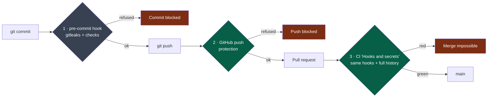

# Contributing

## Before you start

1. Pick a **Ready** issue, tied to a deliverable of the current cycle (`docs/project/`).
2. Identify **the** target module — exactly one.
3. Read its `MANIFEST.yaml`, then its `AGENTS.md`.
4. `nstack bootstrap <name> && nstack check <name>`
5. `pre-commit install` — once per clone ([install pre-commit](https://pre-commit.com/#install)).

## The barriers against leaks

**Legend** — grey: on the workstation, bypassable · green: GitHub side · red: a stop.

Only barriers 1 and 2 act **before** publication. A secret caught by CI is already
public: that is an incident, and it is revoked immediately (`SECURITY.md`).

## While you work

- **Write the oracle first**, watch it fail, then implement
  (`docs/os/05-workflow.md` §3).
- **Minimal change.** No opportunistic refactoring: it gets its own pull request.
- **Stay in the module.** Need another one? Go through its contract. The contract is not
  enough? That is a contract change, so an expand/contract sequence
  (`docs/os/03-contracts.md` §4) — never a single pull request.
- `nstack fitness` before every commit.

## Opening the pull request

The template applies the Definition of Done. Three things not to skate over:

- **The summary** — `DONE / VERIFIED / ASSUMED / NOT VERIFIED / RISKS`.
  A summary with nothing under `ASSUMED` and `NOT VERIFIED` is almost always incomplete.
- **The test sheet** — when a user sees the change: scenarios written before the code,
  results filled in by a verifier who is not you, each with its evidence
  (`playbooks/verification.md`).
- **The signals to report** — that is how the system improves
  (`docs/os/10-measurement.md`).

## Exceptions

| Label | When | Consequence |
|---|---|---|
| `cross-module` | A PR touching several modules, with a justification | Allowed, counted |
| `over-budget` | Generation, mechanical migration, mass rename | Allowed, counted |
| `out-of-cycle` | An incident, a production defect, with "Out of cycle: <reason>" | Allowed, counted |

Exceptions are **visible**, never silent. Their rate is a health indicator for the
boundaries.

## What is not negotiable

- No quality gate bypass: no `skip`, no `--no-verify`, no test disabled without an issue
  and a date.
- No secret in the repository, in any form.
- Never tick "tests passing" without having run them.
