# tool-library

Tool Library lets neighbours lend and borrow tools.

> A public validation project of the NapkinStack framework: an invented subject, test
> data only, no real person's contact. It rehearses a team's way of working —
> framing, cycles, test sheets, two teams behind one contract — before the framework
> serves a real project.

---

> **This project was created by `nstack init`**, the command of the NapkinStack
> engineering framework. This section is the manual for the foundation. Replace it with
> your project's own README once the installation is finished — the method stays in
> `docs/os/`.

```mermaid
flowchart LR
    I["nstack init<br/>project created and committed"]:::cmd --> G["GitHub repository<br/>checklist applied"]:::team
    G --> D["nstack doctor<br/>workstation and settings"]:::cmd
    D --> X["nstack discover idea.md<br/>then the discovery, with your agent"]:::cmd
    X --> F["Framing with your agent<br/>charter + first cycle"]:::team
    F --> M["nstack new-module<br/>first module"]:::cmd
    M --> W["Work in pull requests<br/>CI: fitness, hooks, secrets, sheet, cycle"]:::team
    W --> U["nstack update<br/>new version, reviewed branch"]:::cmd
    U --> W

    classDef cmd fill:#1f2937,color:#fff
    classDef team fill:#065f46,color:#fff
```



**Legend** — grey: an `nstack` command · green: the work of the team and its agent.
CI decides as soon as the rulesets require it: what does not pass does not merge (see
"Prerequisites").

## Prerequisites

- **Workstation**: uv and git; read access to GitHub (the NapkinStack skeleton) and to
  PyPI.
- **GitHub repository.** Workflows inform; only rulesets and push protection block. What
  each case allows:

| Setting | Public repository | Private, Free plan | Private, Team or Pro |
|---|---|---|---|
| Rulesets: PR, review, CODEOWNERS, required checks | Yes | **No: nothing blocks the merge** | Yes |
| Secret scanning and push protection | Yes | No | Paid Secret Protection option |
| Private vulnerability reporting | Yes | Does not exist | Does not exist |
| CI minutes | Unlimited | 2 000 per month | Per the plan |

`nstack doctor` follows the repository's visibility and names the plan required for every
missing setting.

## Installation

```bash
# 1. Tooling at the project's NapkinStack version (prerequisite: uv)
uv tool install "napkinstack==0.3.1" --with-executables-from pre-commit

# 2. Hooks, once per clone
pre-commit install

# 3. Frame the project with your agent (nstack discover, playbooks/framing.md), then create the first module
nstack new-module billing acme/billing standard

# 4. Check that the guardrails answer
nstack fitness
```

That version is the one in `.copier-answers.yml`; it only changes through `nstack update`,
in a reviewed pull request.

## Receiving a new version of NapkinStack

```bash
uv tool install "napkinstack==X.Y.Z" --with-executables-from pre-commit  # the version you want
nstack update                            # branch nstack/update-vX.Y.Z, merged and committed
git push -u origin nstack/update-vX.Y.Z  # then the PR, validated by CI
```

The merge keeps the project's adaptations and never touches the modules' code. A conflict
stays marked in the file, uncommitted: the team decides, and both the hook and CI reject
any remaining marker.

## To do once on GitHub — otherwise nothing is guaranteed

Workflows **inform**; it is the rulesets that **block**. Without this step the whole
edifice rests on goodwill, which the OS forbids (`docs/os/07-governance.md`).

Settings → Rules → Rulesets → on the main branch (private repository: Team or Pro plan):

- [ ] Pull request required: no direct push to main
- [ ] At least 1 approving review
- [ ] Code owner review required
- [ ] Required checks: `Fitness functions`, `PR scope and review budget`, `Hooks and secrets`, `Test sheet and cycle`
- [ ] Bypass list empty: nobody merges around the rules, administrators included

Settings → Advanced Security (private repository: the Secret Protection option):

- [ ] Secret Protection and push protection
- [ ] Private vulnerability reporting, public repository (the `SECURITY.md` channel)

Settings → Actions → General:

- [ ] Allowed actions: GitHub's own, plus `astral-sh/setup-uv`
- [ ] SHA-pinned actions required
- [ ] Workflow approval for every outside contributor
- [ ] Workflow token read-only; Actions neither creates nor approves pull requests

Issues → Labels:

- [ ] Labels `cross-module`, `over-budget` and `out-of-cycle` — they make the exceptions
  visible **and countable** (`docs/os/10-measurement.md` §3)

Settings → Developer settings → GitHub Apps → New GitHub App, then install it on this
repository — **the identity your agents work under** (`docs/os/07-governance.md` §7):

- [ ] Permissions: Contents, Pull requests and Issues read and write; Actions and Checks
      read; Workflows write only when agents maintain CI; never Administration
- [ ] No webhook; installable only on this account
- [ ] Its private key stored outside any repository: the workstation's secret store, or
      the CI's secrets
- [ ] The agent's session reaches no human credential

Then check, read-only:

```bash
nstack doctor
```

`nstack doctor` reads the token from `GH_TOKEN`, otherwise `GITHUB_TOKEN`: a fine-grained
token, limited to the repository, with the **Administration: read** permission. Without a
token, the GitHub part stays "not verified", never compliant.

---

## What is in this repository

| Path | Role | Who reads it |
|---|---|---|
| `AGENTS.md` | **The kernel**: the rules loaded for every task | Agents, every time |
| `playbooks/` | Rules loaded **by trigger** (security, data, UX…) | Agents, when triggered |
| `modules/` | The code — one unit of parallelism per folder | Humans and agents, scoped |
| `contracts/` | The **only** channel between modules | Producers and consumers |
| `.nstack/` | Tooling configuration: playbooks exposed as skills | The foundation team |
| `docs/os/` | **The handbook**: the why behind every rule | Humans, once |
| `docs/project/` | **The discovery, the charter and the cycles**: who it is for, what is delivered now | Everyone, agents first |
| `docs/adr/`, `docs/pdr/` | The decisions taken, with their success criterion | Everyone, on demand |
| `.copier-answers.yml` | The NapkinStack version and the creation answers | `nstack update`, the only thing that changes it |
| `.github/` | What makes the rules non-bypassable | GitHub |

> **`docs/os/` is never loaded into an agent's context.** It is the human reference. An
> agent loads: the kernel, the module's `AGENTS.md`, a playbook when triggered. That is
> the whole difference between a handbook and an operating system.

---

## The commands

```bash
nstack --help        # lists the commands
nstack fitness       # manifests + boundaries + skills + plan — before every commit
nstack discover <idea-file>   # starts a discovery, for your agent
nstack plan          # the discovery, the charter and the cycles (docs/project/)
nstack skills        # generates the Claude Code skills from the playbooks
nstack new-module <name> <owner> <criticality>
nstack check [module]   # MANIFEST commands: check, test, bootstrap; default: all
nstack run <module>     # local start, when commands.run is declared
nstack e2e [module]     # end-to-end scenarios, when commands.e2e is declared
nstack pr-check --body-file <file>   # test sheet and cycle, as CI reads them from the pull request
# check, test and run of a module: the `commands` section of its MANIFEST.yaml
```

Every module exposes the **same verbs**, whatever its technology. That is what lets
someone move between modules without relearning anything (`docs/os/09-platform.md` §2).

---

## Claude Code skills

The playbooks are exposed as skills, so that loading them on demand becomes the runtime's
job rather than a kernel instruction.

```bash
nstack skills           # generates .claude/skills/ from playbooks/
nstack skills --check   # checks they are in sync (runs in CI)
```

**`playbooks/` stays the source of truth.** The skills are generated, gitignored, and
never edited by hand — you change the playbook, then regenerate. A playbook with no entry
in `.nstack/skills.yaml` fails CI; a generated skill that has drifted fails
`nstack skills --check` locally.

This indirection has a reason: a tool is an **adapter**, never a foundation
(`docs/tooling-profile.md`). If the rules existed only as skills, the OS would stop
working with any other agent — and the trigger table of kernel §4 is there for exactly
that case.

Enforcement, on the other hand, **never moves down into a plugin**. An agent-side hook is
fast feedback, not a guarantee: the blocking checks stay in CI
(`docs/os/07-governance.md` §4).

---

## The three rules to remember

1. **One PR = one module.** A change touching two goes through an expand/contract
   sequence on the contract (`docs/os/03-contracts.md` §4).
2. **The oracle before the code.** The success criterion is executable and red before the
   first generated line (`docs/os/05-workflow.md` §3).
3. **Convention is the default choice.** It needs no justification; every deviation is
   justified by an observable user value (`docs/os/06-decisions.md` §2).

---

## What is not provided — and why

No stack: no language, no application framework, no database. The OS imposes a **selection
method** and a decision trail, not a list of technologies (`docs/os/06-decisions.md` §7).

A new module therefore declares commands "to be declared", which fail: wiring `check`,
`test` and `run` onto your own tooling is your job. The **names** never change, the
**content** is yours.

## What is left to wire after the installation

- [ ] The `check` and `test` commands of every module, in its `MANIFEST.yaml`
- [ ] The contract format chosen, and the contract tests that go with it
- [ ] The review budget values (400 lines / 15 files are a starting point)
- [ ] Re-read the `description` fields in `.nstack/skills.yaml` — they are what triggers
      the skills, and they must speak your domain's vocabulary
- [ ] The `e2e` command of every user-facing module, and the tools that drive a browser or
      an emulator, in `docs/tooling-profile.md`
