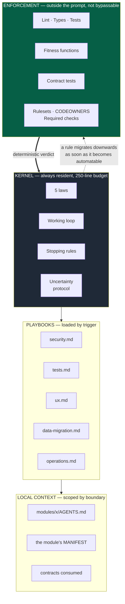
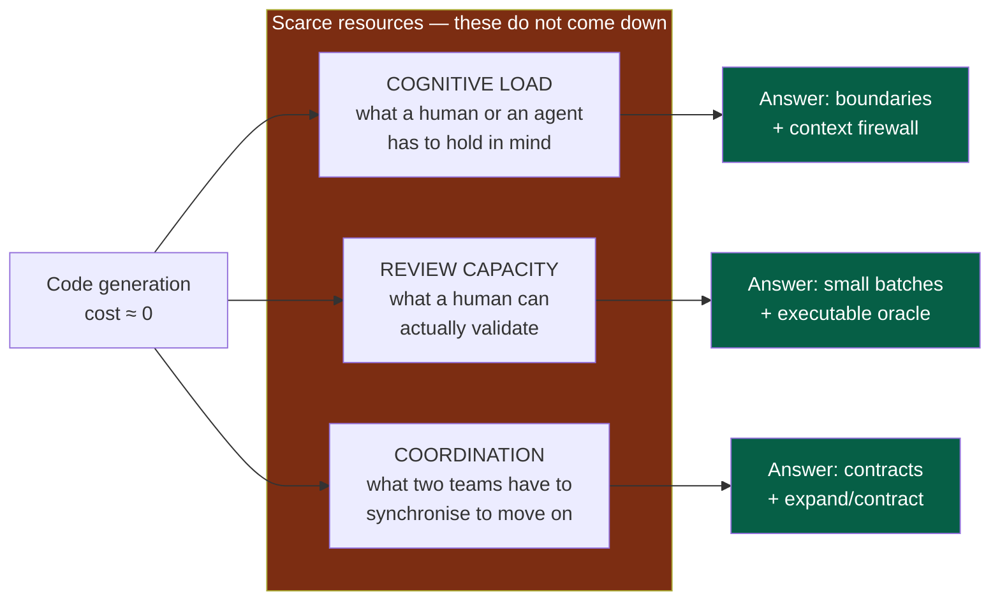

# 00 — Overview

## 1. What an "OS" means here

The metaphor is not decorative. An operating system has:

- a **kernel**: small, resident, loaded at all times;
- **modules loaded on demand**: present only when needed;
- a **partitioned user space**: each process sees its own context, not anyone else's;
- **hardware guarantees**: what the kernel cannot guarantee by convention, the hardware
  enforces.

The most frequent mistake when writing a "system of rules for agents" is to put
everything in the kernel. You end up with a 6 000-word prompt that consumes the context
budget it claims to protect, on every task, including fixing a typo.

This OS therefore spreads its rules across four layers, each with a different cost and a
different loading mode.

---

## 2. The four layers

**Legend** — dark grey: the resident layer, the expensive one · green: the deterministic
layer, free in context · dotted: the migration that makes the OS work.

The dotted arrow is the central mechanism of the OS:

> **The prompt is a transit zone, not a place of residence.**
> A rule stays there only long enough to become a check.

A rule that stays in the prompt although it is mechanically checkable is a **debt**. It
must appear in the automation backlog (`07-governance.md`).

---

## 3. Why this split

| Layer | Reliability | Context cost | Setup cost | Bypassable? |
|---|---|---|---|---|
| Kernel | Probabilistic | High (permanent) | None | Yes |
| Playbooks | Probabilistic | Medium (occasional) | Low | Yes |
| Local context | Probabilistic | Low | Low | Yes |
| Enforcement | **Deterministic** | **None** | Medium to high | **No** |

Enforcement is the only layer that costs nothing in context and does not depend on the
vigilance of an agent or a human. That is why everything that can move down to it must.

Operational corollary: **the AI must never be the only thing preventing a bad change.**

---

## 4. The three scarce resources

The whole OS is sized by three constraints, and by them alone.

**Legend** — red: what generation speed does not relieve · green: the OS's answer to each.

**A project's real throughput is not its generation throughput, it is its verification
throughput.** Doubling production speed without touching review capacity does not double
delivery: it lengthens the queue and degrades the quality of the review itself.

---

## 5. What the OS does not impose

- **No technical stack.** No language, no application framework, no database, no cloud.
  The OS imposes a *selection method* and a decision trail. See `06-decisions.md`.
- **No internal module structure.** Two modules may have different internal
  architectures. Only their *envelope* is uniform. See `02-modules.md`.
- **No list of AI tools.** The OS describes the *capabilities* needed; a tooling profile
  maps them onto the tools of the moment. See `09-platform.md`.
- **No uniform level of ceremony.** Governance is proportionate to the module's declared
  criticality. See `07-governance.md`.

### What the framework cannot know: three levels of rules

| Level | Holds | Maintained by |
|---|---|---|
| **Framework** — identical in every project, received through updates | Postures, the five laws, the working loop, stopping rules, framing, the test discipline, templates, checks | The framework |
| **Project** | Users, problem, constraints, success criteria, cycles, the project's decisions, its tools | The foundation team and the decider: `docs/project/`, `docs/adr/`, `docs/pdr/`, `docs/tooling-profile.md` |
| **Module** | Its capability, commands, contracts, scenarios | Its owner: `MANIFEST.yaml`, local `AGENTS.md` |

**The framework never names a stack, a tool or a business domain.** A project rule is
written in a project document, never in the kernel or a playbook: the framework's files
keep merging cleanly at every update.

---

## 6. Glossary

These terms have a precise meaning in the OS. Using them differently creates ambiguity.

| Term | Definition |
|---|---|
| **Module** | An autonomous unit of context and of parallelism: a developer or an agent must be able to understand it, change it, test it and validate it **without understanding the rest of the system**. It can be a package, an application, a service or a repository. |
| **Playbook** | A module of *instructions* for an agent, loaded on demand (`playbooks/`). Called a "playbook" rather than a "module" to avoid any confusion with the line above. |
| **Skeleton** | The project's shared files — kernel, playbooks, this handbook, CI, hooks, templates — generated by the engine; the project owns them and adapts them. |
| **Engine** | The versioned tool that generates the skeleton, updates it and runs the checks; named in `docs/tooling-profile.md`. |
| **Contract** | A versioned, tested interface between two modules: API, event, schema, message. The **only** channel of inter-module communication allowed. |
| **Manifest** | A declarative file at the root of every module: identity, owner, criticality, status, contracts provided and consumed, standard commands. The machine-readable source of truth. |
| **Oracle** | A task's *executable* success criterion, written and seen failing **before** generation: a test, a contract test, or a fitness function. |
| **Fitness function** | An automated test that fails when the architecture drifts (forbidden dependency, cycle, coupling, performance budget). Governance by rule rather than by inspection. |
| **Review budget** | An explicit ceiling per pull request (lines, files, modules touched) that forces the split **before** generation. |
| **Prior Art Gate** | The mandatory procedure before a structuring decision: identify the convention of the field, adopt it by default, deviate only against an observable user value. |
| **Expand / Contract** | The sequence of pull requests that lets a contract evolve between teams without temporal synchronisation. |
| **ADR / PDR** | Architecture / Product Decision Record. A durable trail of a structuring decision. |
| **Appetite** | The calendar time the decider chooses to spend on a cycle — not an estimate. It sets the cycle's end date. |
| **Charter** | The project's founding document: users, problem, constraints, success criteria, out of scope (`docs/project/charter.md`). |
| **Circuit breaker** | A cycle's end date: past it, delivery work stops and the decider chooses — ship, re-frame or stop. No automatic extension. |
| **Cycle** | A bounded unit of work: one goal, a finite list of deliverables, an appetite, an end. |
| **Deliverable** | An outcome a user can observe, with acceptance criteria, in one module. |
| **Discovery** | An idea tested before any charter: sourced evidence, a value hypothesis, a challenge by another session, then go, clarify or kill (`docs/project/discovery.md`). |
| **Posture** | What a participant does, and never does: framer, challenger, author, verifier, approver, decider, owner (`05-workflow.md` §10). |
| **Test sheet** | The scenarios of a change, written before the code and run by a verifier who is not the author, each with its evidence (`05-workflow.md` §7). |

> **Note.** The **FDR** (Functional Design Record) format does not exist in this OS. It
> overlapped the PDR and an issue's acceptance criteria without adding distinct value.
> For genuinely complex cases, it becomes an **optional section of the PDR**.
> Justification: `06-decisions.md` § "Why only two formats".

---

## 7. How to read the rest

| Document | Answers the question |
|---|---|
| `01-principles` | What do we never compromise on? |
| `02-modules` | How do we split the system, and how do several teams move in parallel? |
| `03-contracts` | How do we change an interface without blocking the other team? |
| `04-ai-context` | What do we load, and what do we do when a boundary is crossed? |
| `05-workflow` | How does a task actually unfold? |
| `06-decisions` | How do we decide, and how do we avoid reinventing the wheel? |
| `07-governance` | Where does a rule live, and how does it become non-bypassable? |
| `08-quality` | What do we test, and how far, depending on the risk? |
| `09-platform` | How do we start a module with one command? |
| `10-measurement` | How do we know the system is improving? |
