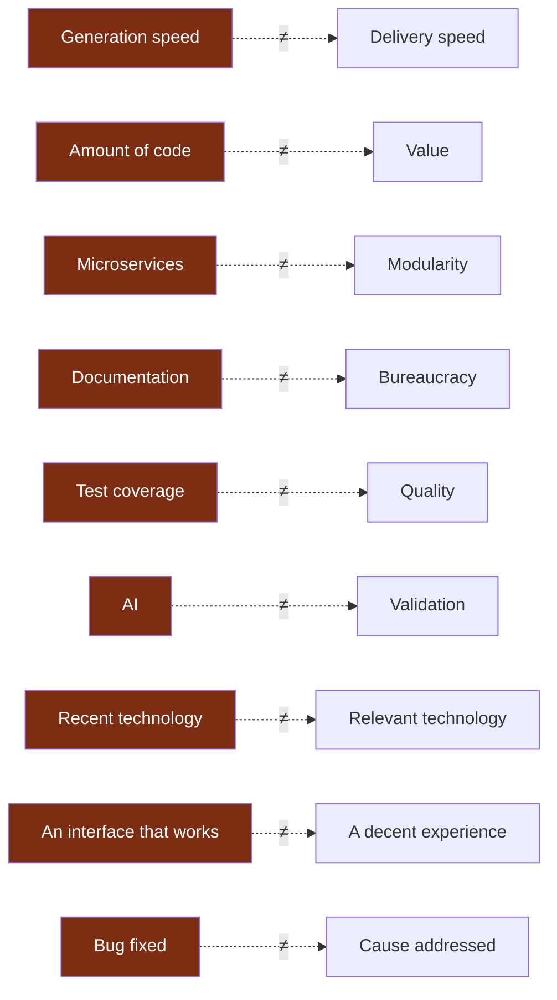
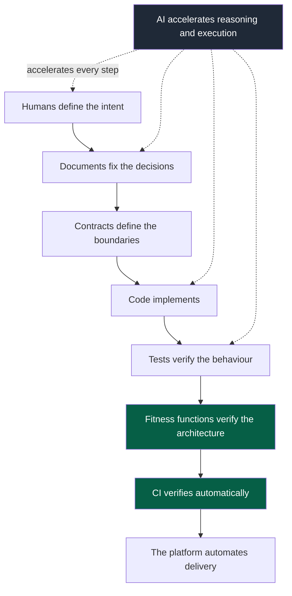

# 01 — Principles

## 1. The five laws

These are the only rules that override all others, including a module's local
instruction. They sit in the kernel because they apply to *every* task, without
exception.

### Law 1 — Boundary

> You work in a single module. You know the others only through their contracts.

**Why.** This is what makes parallelism possible: if a change can touch anything, then
two teams cannot work at the same time without stepping on each other, and an agent has
to load an unbounded context to be sure it breaks nothing.

**Consequence.** Crossing a boundary is not forbidden — it is made **explicit and
expensive**, therefore rare and traceable. See `04-ai-context.md`.

### Law 2 — Oracle

> No generation until the success criterion is executable.

**Why.** An agent is a probabilistic system. The only reliable way to constrain it is to
set a deterministic judge against it. Without an oracle, validation rests on a human
reading code produced in forty seconds — that is, on the project's scarcest resource.

**Consequence.** The usual order, "I write the code then I test it", is reversed. If the
criterion *cannot* be made executable, that is not a detail of method: it is the sign
that the task is badly framed.

### Law 3 — Convention

> The established solution is the default choice and needs no justification.
> Every deviation is justified by an observable user value.

**Why.** An LLM always produces a plausible, bespoke answer, including when the right
answer is "this has been solved for twenty years, here is the convention". The asymmetry
of justification corrects that structural bias.

**Consequence.** Elegance, future flexibility and technical preference are not
acceptable justifications. See `06-decisions.md` § Prior Art Gate.

### Law 4 — Minimum

> The minimal change that satisfies the oracle.

**Why.** Every unnecessary line consumes review capacity, increases the regression
surface and becomes code somebody will have to understand later.

**Consequence.** No opportunistic refactoring inside a feature pull request. No
anticipation of an undemonstrated need. No speculative generalisation.

### Law 5 — Truth

> Always distinguish fact, assumption, decision, recommendation, uncertainty.

**Why.** A confident but false statement costs more than no answer at all, because it is
absorbed without being checked.

**Consequence.** Never write that a test passes without having run it. Never invent an
API, a command, an option, a version or a tool capability. If the information is
verifiable, verify it; otherwise, say so.

---

## 2. Design principles

They are not in the kernel because they guide design rather than the execution of a
task. They remain enforceable in review and in an ADR.

| # | Principle | Practical test |
|---|---|---|
| 1 | User value before technical output | Who benefits from this change, and how will we know? |
| 2 | Simplicity before sophistication | What is the dumbest version that works? Why not take it? |
| 3 | Explicit before implicit | Would a newcomer guess this behaviour, or must they discover it? |
| 4 | Small changes before large ones | Is this batch reviewable in one session of attention? |
| 5 | Strong boundaries before hidden coupling | Does this module stay understandable on its own? |
| 6 | Contracts before implementation dependencies | Can I rewrite the other module without breaking this one? |
| 7 | Automation before human memory | Does this rule survive the departure of whoever wrote it? |
| 8 | Deterministic validation before AI judgement | What says this is correct: a check, or an intuition? |
| 9 | Documentation as versioned knowledge | Will this decision be findable in six months? |
| 10 | Security and reliability by design | What breaks, and what happens then? |
| 11 | Reversible decisions where possible | How much does going back cost? |
| 12 | Incremental evolution rather than big bang | Does the system stay coherent at each step? |
| 13 | Every important rule must become checkable | Where does this rule live? (see `07-governance.md`) |
| 14 | The AI context stays deliberately bounded | Have I loaded more than necessary? |
| 15 | Never complexity without a measurable reason | What number or behaviour justifies this extra cost? |

---

## 3. The confusions never to make

Each of these is an observed failure mode, not a figure of speech.

**Legend** — red: the tempting term, on the left of each pair; what it is not follows it.

A few clarifications, because these confusions are expensive:

**Microservices ≠ modularity.** Splitting into services without decoupling data and
contracts produces a *distributed monolith*: every drawback of distribution, none of the
benefits of modularity. A boundary must reduce the cost of change, not move the code into
another folder.

**Coverage ≠ quality.** A project at 90 % coverage where no critical business rule is
tested is less safe than one at 40 % that covers the high-impact journeys. You test
according to risk, never according to an arbitrary numeric target.

**Documentation ≠ bureaucracy.** The criterion is simple: *documentation must reduce
cognitive load, not increase it*. A document that is never read, never updated and never
enforceable must be deleted.

---

## 4. AI in this system

What AI does well: explore, reason, propose, generate, refactor, write tests, document,
review, research, and above all **challenge a decision**.

What it must never be: the guarantee.

Never trust without verification:

- an unsourced statement;
- an assumed API, option or version;
- a library assumed to exist;
- a test result that was not run;
- an undocumented architectural decision.

> **Final rule.** The AI must never be the only thing preventing a bad change. The
> important rules are codified in the system.

---

## 5. The chain of guarantee

This is the overview of what the OS builds: a series of links, none of which rests on
vigilance.

**Legend** — green: the deterministic links · dark grey: the AI, beside the chain ·
dotted: what it accelerates.

Note where the AI sits: **beside** the chain, never **inside** the chain of guarantee.
