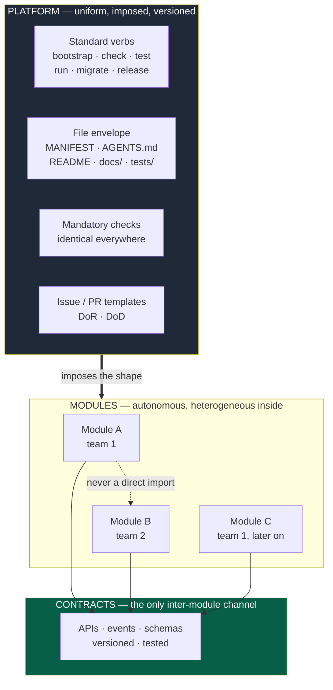
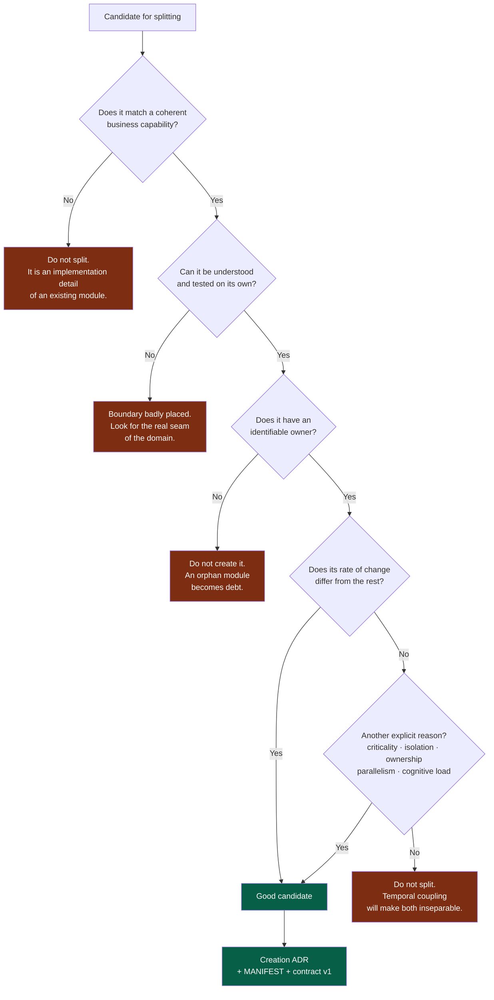
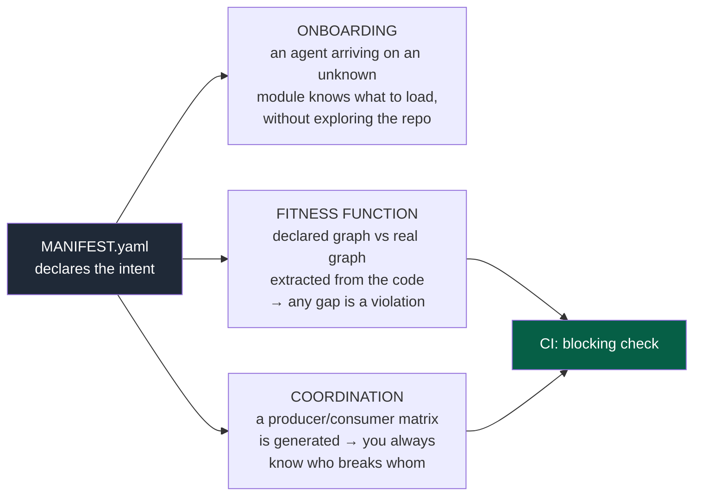
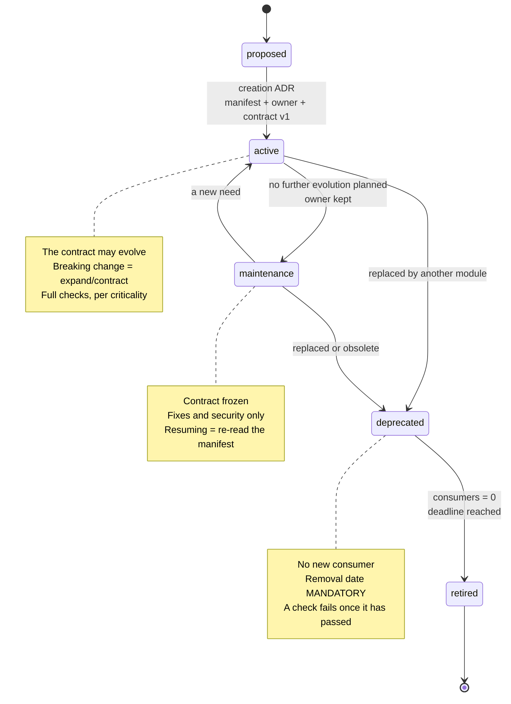
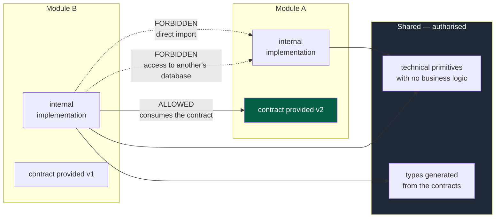

# 02 — Modules and boundaries

## 1. The fundamental rule

> A developer or an agent working on a module must be able to **understand, change, test
> and validate** that module without having to understand the whole system.

That is the operational definition of a module. Everything else — granularity,
ownership, contracts, lifecycle — follows from it.

If that property does not hold, it is not a module: it is a folder.

---

## 2. What is uniform, and what is not

The classic multi-team trap: so that everyone "works the same way", the *implementation*
gets standardised — same framework, same layers, same internal patterns. That produces
coupling by convention, ages badly, and stops each team adapting its module to its
domain.

What is standardised is the module's **engineering interface**: how it is discovered,
started, tested, validated and shipped.

> A developer or an agent moving between modules finds the same **verbs**, never the same
> **code**.



**Legend** — dark grey: what the platform imposes · green: the only authorised channel ·
dotted: what is forbidden.

The rule fits in one sentence:

> **Two modules know each other only through their contract. Two teams coordinate only
> through the contract. Everything else is local.**

### The dividing line

| Category | Uniform? | Detail |
|---|---|---|
| Command verbs | **Yes, imposed** | `09-platform.md` |
| File envelope | **Yes, imposed** | §4 below |
| Mandatory checks | **Yes, imposed** | `07-governance.md` |
| Contract format | **Yes, imposed** | `03-contracts.md` |
| ADR / PDR formats | **Yes, imposed** | `06-decisions.md` |
| Language, framework, database | No | Local decision, ADR when structuring |
| Internal architecture, patterns | No | Local decision |
| Detailed test strategy | No | Guided by risk, `08-quality.md` |
| Internal naming conventions | No | Local, described in the module's `AGENTS.md` |

**Mind the cost of heterogeneity.** Technical autonomy is not free: it is paid for in the
ability to lend a hand between teams, in tooling to maintain, in security surface. The
freedom exists, but an ADR is expected as soon as a module introduces a technology absent
from the rest of the project, and the Prior Art Gate applies (`06-decisions.md`).

---

## 3. Granularity: where to cut

Never create artificially small modules. A module represents a **coherent capability**,
not a table, an entity or a handful of endpoints.



**Legend** — green: split, and what it costs · red: do not split, and why.

The criteria that legitimately determine granularity: the domain, the level of coupling,
ownership, the rate of change, criticality, the need for isolation, and cognitive load.

Splitting is therefore **not only a deployment decision**. It also serves to bound an
agent's context, reduce the blast radius of a change, allow parallel work and make local
validations reliable.

---

## 4. A module's envelope

The minimal structure, identical everywhere:

```
modules/<name>/
├── MANIFEST.yaml        ← machine-readable identity (§5)
├── AGENTS.md            ← local AI instructions: only what is specific
├── README.md            ← for humans: what it is for, how to start
├── docs/
│   ├── adr/             ← local technical decisions
│   └── runbook.md       ← when the module is operated in production
├── src/
└── tests/
```

The contracts a module provides live in the project's `contracts/` module, one folder per
contract and version (`03-contracts.md` §2), and its manifest points at them
(`provides[].path`).

**Rule for the local `AGENTS.md`**: it contains only what is specific to the module.
Never duplicate a kernel rule there. A local `AGENTS.md` that repeats the kernel is a
bug — it wastes context and creates a risk of divergence.

Typical content of a local `AGENTS.md`: internal conventions nobody could guess, known
traps, business invariants, non-standard commands, areas not to change and why.

---

## 5. The Module Manifest

This is the piece that makes multi-team work operational. A single declarative file,
readable by a human, by an agent **and by CI**.

See `templates/MANIFEST.example.yaml` for the full format. It declares:

- identity and responsibility in one sentence;
- owner (a team, not an individual);
- lifecycle status;
- criticality level — it determines the level of governance required;
- contracts provided;
- contracts consumed, with versions;
- standard commands.

### The three uses that justify its cost



**Legend** — dark grey: the declaration · green: the deterministic verdict.

The essential point: **the manifest declares the intent, CI verifies reality.** A contract
a module reads without declaring it fails in CI, and so does any reference to another
module's code, declared or not; a contract declared and never read is reported. No semantic
analysis is needed — it is a comparison of graphs.

---

## 6. A module's lifecycle

Needed as soon as a team works sequentially on several modules: without an explicit
status, a team coming back to a module six months later does not know what it is allowed
to break.



The status lives in the manifest, so it is checkable:

| Situation | CI result |
|---|---|
| A `maintenance` module whose contract changes | **Red** |
| A `deprecated` module that gains a consumer | **Red** |
| A `deprecated` module whose removal date has passed | **Red** |
| An `active` module with no declared owner | **Red** |

This is what avoids **permanent intermediate states**: a deprecated path that never
disappears because nobody is responsible for removing it.

---

## 7. One PR, one module

This is the system's most profitable constraint. Objective, automatable, and every
violation becomes an architecture signal.

**Rule.** A pull request changes the files of a single module. Exceptions exist but are
visible, traced and counted.

A module is touched when its behaviour changes: editing only its description — manifest,
`AGENTS.md`, `README.md`, `docs/` — touches none, and `contracts/` is a module like the
others.

| Exception | Handling |
|---|---|
| Contract change | An expand/contract sequence, never a single PR (`03-contracts.md`) |
| Foundation change | Skeleton files: the foundation team, wider review; the `platform/` module when it exists (`09-platform.md` §1) |
| Critical incident fix | Allowed, label required, ADR or post-mortem within 5 days |

Unblocking goes through an explicit label on the pull request. That makes the rate of
cross-module changes **measurable for free** — one of the best indicators of boundary
quality (`10-measurement.md`).

---

## 8. Authorised dependencies



**Legend** — green: the authorised channel · dark grey: what may be shared · dotted: the
forbidden paths.

**Forbidden, and automatically detectable:**

- a direct import of another module's internal code;
- direct access to another module's database;
- a circular dependency between modules;
- business logic shared between distinct domains;
- a shared database without a justifying ADR.

**Allowed but worth watching:** shared technical primitives (logging, errors, utilities
with no business logic). As soon as a business rule enters a shared package, two modules
become inseparable. They live outside the module folders: a module never imports another
module's code, and declaring its contract in `consumes` does not change that.

---

## 9. Spotting a bad boundary

A boundary must **reduce the cost of change**. If it only moves the code, it is badly
placed. These signals are measurable, not subjective:

| Signal | How to measure it |
|---|---|
| Pull requests that systematically need several modules | Cross-module PR rate (§7) |
| Modules always deployed together | Correlation of releases |
| Circular dependencies | Fitness function on the graph |
| Cascading synchronous calls | Production traces |
| Too many contracts between two modules | Counted from the manifests |
| Tests that need the whole system | Duration and scope of the local suite |
| Ambiguous ownership | A manifest with no owner, or a PR reviewed by several teams |
| An agent unable to work through the contract alone | Reported by kernel §4 |

The last signal is the most reliable and the cheapest: it is collected on every task, for
free, by the agent itself. **Never work around it quietly.**

When several signals converge on the same pair of modules, open an *Architecture* issue:
the answer is either to merge them or to split them differently, never to add one more
contract.
