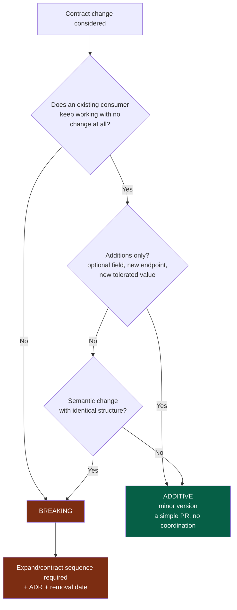
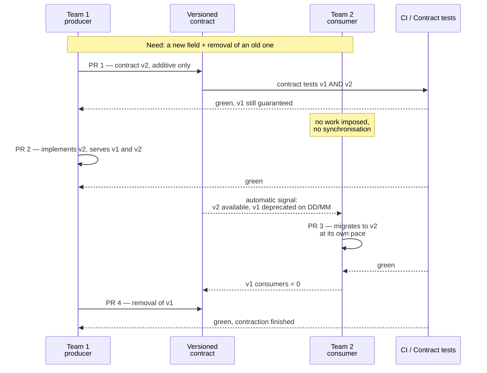
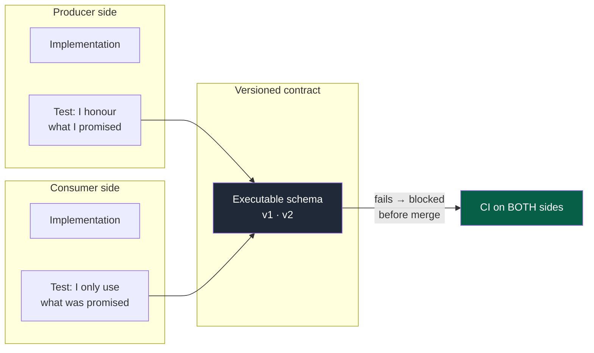

# 03 — Contracts

## 1. Role

The contract is the **only authorised channel of communication between two modules**. It
is also the only point of coordination between two teams.

The entire benefit of splitting into modules rests on one property: I can rewrite the
inside of a module completely without anyone noticing, as long as its contract holds. If
that is not true, the split is decorative.

> An API change is **never** an internal refactoring.

---

## 2. The contract as a module in its own right

`contracts/` is not a utility folder. It is the most critical boundary in the system: it
cannot be orphaned.

Like any module it therefore has an owner, a manifest, its own tests, its own rules of
change, and a high criticality by default.

**Properties required of a contract:**

| Property | Verification |
|---|---|
| Versioned | The version number is part of the identifier |
| Documented | Fields, errors, codes, semantics, examples |
| Automatically validatable | An executable schema, not a description in prose |
| Independent of the implementation | No leak of the producer's internal structure |
| Compatible | An explicit, tested compatibility rule |
| Dated for its deprecations | Every deprecated version carries a removal date |

A contract can cover: a synchronous API, events, messages, schemas of exchanged data,
errors, authentication, authorisation, compatibility and deprecation rules.

---

## 3. Classifying a change

This is the first question to ask, and it can be mechanised. It is: from the moment a
module consumes a version, or its producer marks it `stable`, a change to its files needs the
project's comparator — the `compat` command of the module holding it, as merged — to call it
compatible; otherwise it becomes a new version beside it (`nstack compat`, rule V1). Moving
the version to another folder changes nothing: it is judged wherever it now lives. A version
still experimental, which nobody consumes, is free to change.

**Legend** — green: the cheap path · red: the expensive path, and what it costs.

**The most frequent trap** is node `F`: an unchanged structure but a modified semantics.
A `status` field that gains a value consumers do not know how to handle, a unit that goes
from seconds to milliseconds, a nullable field that becomes always filled. Technically
compatible, functionally breaking. These are the most expensive breakages because no diff
tool detects them — only contract tests do.

---

## 4. Expand / Contract

This is the only known way to evolve a contract between teams **without temporal
synchronisation**. Four pull requests, four independent reviews, zero meetings.

### The four steps in detail

| PR | Who | Content | Guardrail |
|---|---|---|---|
| **1 — Expand contract** | Producer | v2 declared, additive. v1 untouched. | Contract tests v1 **and** v2 green |
| **2 — Expand impl.** | Producer | Serves both versions at once | No consumer affected |
| **3 — Migration** | Each consumer | Switches to v2, at its own pace | Manifest updated: version consumed |
| **4 — Contract** | Producer | Removal of v1 | v1 consumers = 0, checked (B6) |

### The three guardrails

**① The deprecation date is a check.** From PR 1 onwards, v1 carries a removal date. A
check fails once the date has passed and consumers remain. Without it, you accumulate
versions nobody dares remove.

**② The contraction is mandatory.** Step 4 is the most often forgotten, and it is
precisely what produces permanent intermediate states. PR 1 opens a contraction issue,
assigned to the contract's owner: by hand, until opening it is automated.

**③ A version someone relies on is frozen.** The expand step adds v2 beside v1; editing v1
in place passes only when the merged comparator proves the edit compatible (V1).

---

## 5. Contract tests

Without them a contract is only a document — it drifts.

**Legend** — dark grey: the single source both sides test against · green: the blocking
verdict.

Both directions matter, and they catch different mistakes:

- **Producer side**: "I honour what I promised". Prevents breakage through negligence.
- **Consumer side**: "I only depend on what was promised". Prevents depending on
  non-contractual behaviour — the case where the producer breaks someone without having
  violated anything.

Contract tests run in the CI of **both modules**. A contract change that breaks a
declared consumer is caught before merge, without a meeting.

---

## 6. Discovery and traceability

The producer/consumer matrix is **generated** from the manifests, never kept by hand. It
answers three questions no team should have to ask in a meeting:

- Who consumes my contract, and in which version?
- What does my module consume, and which versions are deprecated?
- What is the blast radius of this change?

A minimal dashboard is enough: contracts, versions, consumers, deprecation dates,
overdue contractions.

---

## 7. Anti-patterns

| Anti-pattern | Why it is a problem |
|---|---|
| A contract generated from the producer's internal classes | The implementation becomes the contract: any internal rework breaks consumers |
| The version in the message body rather than in the identifier | Routing becomes conditional and untestable |
| An "optional field" that every consumer actually has to read | Breaking, disguised as additive |
| A contract with no example and no error case | The consumer guesses; the divergences show up in production |
| Removing a version "when we have time" | A permanent intermediate state |
| More than N contracts between the same two modules | A signal of a bad boundary (`02-modules.md` §9) |
| The contract changed in the same PR as the consumer's implementation | Destroys the whole benefit of expand/contract |
