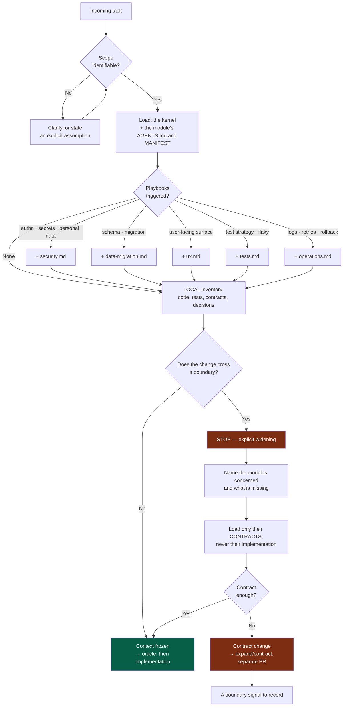

# 04 — AI context

## 1. Context is a resource, not a reservoir

Loading "the whole repo just in case" is the most common and most expensive mistake. It
has three effects, all bad:

1. **Dilution** — the relevant information drowns; reasoning quality drops as the
   context grows.
2. **Boundary contamination** — an agent that *sees* another module's implementation
   ends up using it. Coupling is born of visibility.
3. **Cost** — in tokens, in latency, and in human attention at review time.

> **Never scan the project wholesale "just in case".**

Context isolation is therefore not a prompting technique: it is an **architectural
concern**. Splitting into modules serves as much to bound what an agent has to load as to
organise deployment.

---

## 2. The scoping procedure



**Legend** — green: the nominal path · red: stop, and what it costs.

"**Context frozen**" means: from that point on, no file is added to the context without
going back through the boundary-crossing question. An exploration that widens gradually
during implementation is the symptom of a failed framing, not of a useful discovery.

---

## 3. Loading order and budget

```
1. kernel AGENTS.md                     always        ~250 lines
2. the target module's MANIFEST         always        short
3. the module's local AGENTS.md         always        ~50-100 lines
4. triggered playbook(s)                conditional   1 to 2 at most
5. relevant local code and tests        targeted      not the whole module
6. contracts consumed                   targeted      the contract, not the implementation
7. ADR/PDR tied to the area changed     when they exist
8. another module                       NEVER without an explicit crossing
```

Before exploring, an agent must be able to answer five questions. If one has no answer,
the problem is the framing, not the context:

- Which **module** is concerned?
- Which **contracts** are involved?
- Which **tests** already exist on this area?
- Which **decisions** (ADR/PDR) constrain this choice?
- What is this task's **oracle**?

---

## 4. Crossing a boundary

This is the mechanism that separates a system with boundaries from one that merely looks
like it has them. Crossing is not forbidden: it is made **explicit, expensive and
traced**, and therefore rare.

When a task seems to need a second module, one of these four answers almost always
applies — in this order of preference:

| Answer | When | Cost |
|---|---|---|
| **1. The contract is already enough** | The most frequent case. The information exists, it had not been looked for. | None |
| **2. The contract must expand** | A real need on the consumer side. | Expand/contract (`03-contracts.md`) |
| **3. The task was badly split** | It actually contained two tasks. | Re-split, two issues |
| **4. The boundary is wrong** | The contract structurally cannot suffice. | An *Architecture* issue; do not work around it |

**Case 4 is the system's most valuable signal.** Being unable to work through the
contract alone is the most reliable coupling symptom you can collect — and it is
collected for free, on every task, by the agent itself.

Working around it by importing the other module's code directly destroys the information
*and* the boundary in a single move.

---

## 5. Multiple agents

Use several agents **only** when the benefit is clear:

| Legitimate case | Why |
|---|---|
| Genuinely parallel work on distinct modules | The partitioning is already guaranteed by the boundaries |
| Independent review | A context uncontaminated by the generation detects more |
| An isolated investigation or spike | Avoids polluting the main task's context |
| Comparing two approaches | Each reasoned without knowing the other |
| One-off specialist expertise | Security, performance, accessibility |

Do not multiply agents for a simple task: the cost of coordinating and synthesising soon
exceeds the gain.

**Consistency rule.** The agents share the same sources of truth, the same contracts and
the same decision formats. They **never** each invent their own conventions. Typical
roles: Architect, Product, Software Engineer, QA, Security, UX/UI, DevOps/SRE, Reviewer,
Researcher.

**Boundary rule.** Two agents working in parallel work on two distinct modules. Two
agents on the same module means a merge conflict and an impossible review.

---

## 6. Research and verification

When the information is likely to have changed — versions, APIs, options, tool
capabilities, the state of an ecosystem — look it up **before** deciding.

| Do | Do not |
|---|---|
| Prefer primary sources and official documentation | Rely on a memory from training |
| Check versions and compatibility constraints | Assume an option exists because it would be logical |
| Distinguish facts from opinions | Present a preference as a technical constraint |
| Say when the information is not known | Invent an API, a command, a version, a capability |

Order for resolving an uncertainty, from cheapest to most expensive:

```
1. inspect the module and its tests
2. read the contract concerned
3. read the related ADR/PDR
4. look up the official documentation
5. ask for clarification  ← only when genuinely blocking
```

Asking for clarification on something findable in thirty seconds is an unjustified
coordination cost. Moving ahead on an undeclared assumption is worse. The right middle
answer: **move ahead with an explicitly stated assumption**, and surface it in the
closing summary.
