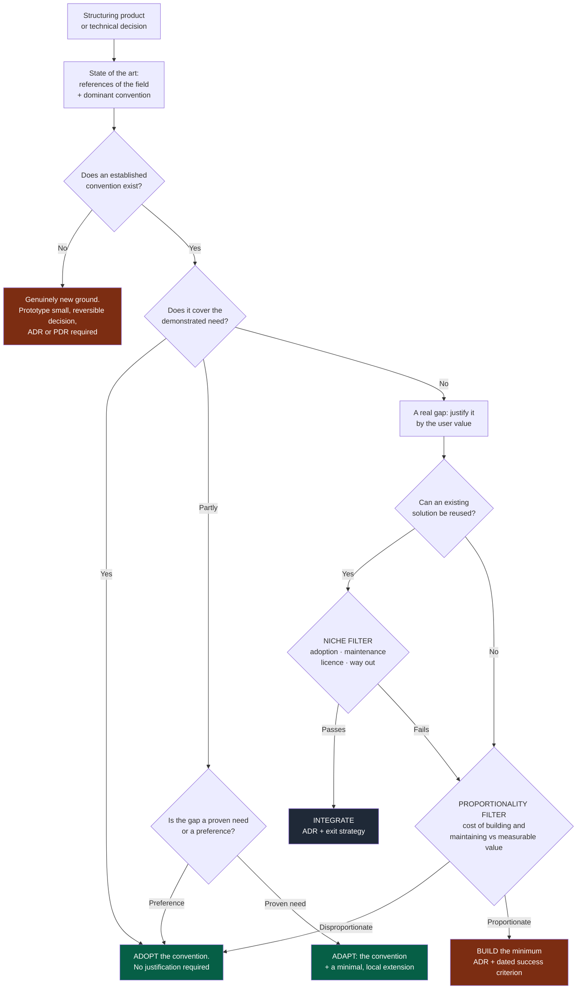
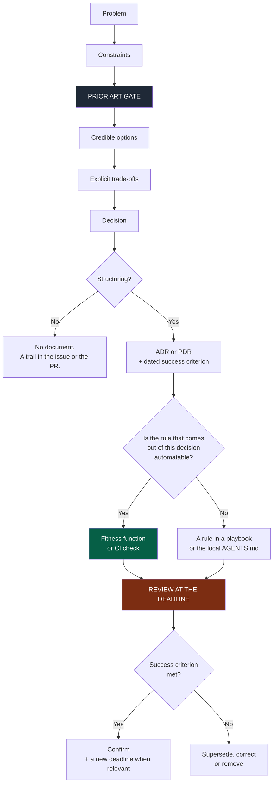

# 06 — Decisions

## 1. The problem

An LLM always produces a plausible, bespoke answer. That is its quality and its
structural flaw: it answers even when the right answer is "this has been solved for
twenty years, here is the convention".

Combined with nearly free generation, this produces three drifts, each expensive:

| Drift | Symptom | Cost |
|---|---|---|
| **Reinventing the wheel** | A homemade solution where a convention exists | Permanent maintenance, nobody knows the code |
| **Over-engineering** | Unrequested abstraction, genericity, flexibility | Complexity that never serves, slower review |
| **Niche** | An exotic technology or pattern adopted too fast | Hiring, support, security, no way out |

The Prior Art Gate handles all three with a single mechanism.

---

## 2. The Prior Art Gate

Mandatory before any **structuring** decision — product or technical. Structuring means:
costly to reverse, or constraining the decisions that follow.

Three questions, in this order:

**① Who has already solved this, and how?**
Identify the serious references of the field and the dominant convention. For a product:
what the user already knows and expects to find elsewhere. For a technical decision: the
standard solution, not the most elegant one.

**② Is the convention enough?**
By default, yes. The convention is the free choice: familiar to the user, documented,
hireable for, known to agents, already proven by others.

**③ If we depart from it, what pays for that?**
Every deviation must be paid for by a **named, observable user value**. A deviation
"because it is cleaner", "more flexible" or "more modern" is refused.



**Legend** — green: the free paths · dark grey: integrating something existing · red: the
expensive paths, which carry a dated criterion.

Two properties of this graph are worth noticing.

**The green path is the shortest.** Adopting the convention requires no justification;
everything else does. The asymmetry is deliberate — it is what prevents drift, because it
makes the lazy path and the correct path the same.

**The niche filter feeds back into proportionality** rather than leaving the tree. A
rejected exotic dependency does not automatically lead to "we build it", but to "is it
really worth it".

---

## 3. The two filters

### Niche filter

An existing solution can be reused if it passes these four questions:

| Criterion | Question |
|---|---|
| **Adoption** | Is it used beyond a narrow circle? Can you find answers outside its own documentation? |
| **Maintenance** | Is it actively maintained? By how many people? What happens if they stop? |
| **Licence and security** | Is the licence compatible? What is its surface and its vulnerability history? |
| **Way out** | What does replacing it cost in two years? Can it be isolated behind a local interface? |

The last one is the most important and the most forgotten. **Every significant dependency
declares its exit strategy in the module's manifest.**

### Proportionality filter

Building something bespoke is justified when:

- the need is **demonstrated**, not anticipated;
- the cost of building **and maintaining it over three years** is proportionate to the
  expected value;
- the minimal solution is identified — you build that one, not the generic version.

Control question, to ask every time:

> What is the dumbest version that solves the problem, and why are we not taking it?

If the answer is "because it would not cover case X", check that case X is real and not
hypothetical. In most cases, it is not.

---

## 4. The two decision formats

### ADR — Architecture Decision Record

For a significant **technical or architectural** decision: technology choice, module
boundary, data strategy, structuring pattern, major dependency, a performance or security
trade-off.

Minimum content: context · problem · constraints · **prior art** · options considered ·
decision · consequences · rejected alternatives · a **dated success criterion** when
building something bespoke.

A replaced decision is **superseded by a new decision**, never rewritten quietly. The
history of abandoned decisions is often worth more than the current one: it explains why
the apparently obvious does not work.

### PDR — Product Decision Record

For an important **product** decision: a user goal, an expected behaviour, a trade-off, a
structuring business rule, a UX or business decision.

The PDR describes **what the product must do and why**, never its implementation.

Minimum content: the user problem · **prior art** · options · decision · a **dated
success criterion** · a **removal condition** · impacts.

### Why only two formats

The **FDR** (Functional Design Record) format was removed. Between the PDR (the what and
the why) and the issue's acceptance criteria (the expected, testable behaviour), almost
nothing was left to justify a third format — and one more format means one more place to
look, one more to maintain, one more that will diverge.

For genuinely complex features (many actors, state machines, permission matrices), it
becomes an **optional section of the PDR**: *Detailed functional design*.

> Do not create a document when an issue or existing documentation is enough.
> Documentation must reduce cognitive load, not increase it.

### The charter and the cycles are not decision records

The charter (`docs/project/charter.md`) frames the whole project; a cycle plans a bounded
piece of it. Neither records a trade-off: a change to the charter goes through a PDR, and
a cycle changes only through its decider — re-framed, closed or stopped, never extended.

---

## 5. The dated success criterion

This is what makes a decision **falsifiable**, and therefore useful.

Every `BUILD` decision, every PDR, and every ADR that deviates from the convention
carries a sentence of this form:

> *We will consider this was the right call if* **\<measurable observation\>** *is
> observed before* **\<date\>**.

Without a date nobody ever comes back to check, and `docs/adr/` becomes a graveyard —
which is worse than no documentation at all, because it inspires false confidence.

### Removal condition

Every significant feature carries, from its PDR onwards, its deletion criterion. It is
the product counterpart of the architecture rule: *when a new path replaces an old one,
plan the removal of the old one too*.

A feature with no removal condition is a permanent feature by default, including when
nobody uses it.

---

## 6. The decision loop



**Legend** — dark grey: the gate · green: the rule leaves the prompt · red: the step
almost every project skips.

The `REVIEW AT THE DEADLINE` step is the one missing from nearly every project. A light
ritual is enough: once a quarter, list the decisions whose criterion has come due, and
decide — confirmed, superseded, or the feature is removed.

---

## 7. Technology choices

No stack is imposed by this OS. But the choice follows a method.

**Never choose a technology because**: it is popular; it is fashionable; the AI knows it
well; it is used elsewhere; it makes it quick to generate code.

**Procedure:**

```
1. identify the real requirements
2. identify the constraints (team, operations, security, budget, what exists)
3. PRIOR ART GATE — what is the convention of the field?
4. identify the credible options
5. research CURRENT information — versions, maturity, state of the project
6. compare against explicit criteria written in advance
7. assess the cost of migration, of maintenance and of GETTING OUT
8. assess security, maturity, longevity
9. choose the PROPORTIONATE option
10. document it when structuring
```

For any technology likely to move fast, check the official documentation and its current
state **before** deciding. Never rely on a memory.

> **Never present a personal preference as a technical constraint.**

---

## 8. Making the gate deterministic

Otherwise it stays a pious wish — and the OS falls back into exactly the flaw it
denounces: a rule that is only text produces no behaviour.

| Mechanism | Expected check |
|---|---|
| A mandatory **Prior art** section in ADRs and PDRs, with ≥ 2 named references and the convention identified | Section or reference missing → red |
| A mandatory **Deviation** section as soon as the decision departs from the convention, with the user value and the observation criterion | A decision marked "deviation" without the section → red |
| Every new dependency declares **adoption and exit strategy** in the manifest | Undeclared dependency → red |
| `BUILD` decisions: a **dated success criterion** is mandatory | No date → red |
| A deadline passed without review | A CI warning, raised at the quarterly ritual |

As long as one of these checks is not automated, it happens in review and sits in the
automation backlog (`07-governance.md` §9): writing "red" is not enough to make it true.

Short formulation, for the kernel:

> The convention is the default choice and needs no justification. Every deviation is
> justified by an observable user value, never by elegance, future flexibility or
> technical preference.

---

## 9. Sources of truth

Every important piece of information has one identifiable source, and only one.

| Information | Source of truth |
|---|---|
| Product decision | PDR |
| Technical decision | ADR |
| Expected behaviour of a feature | The issue's acceptance criteria |
| Interface between modules | The versioned contract |
| A module's identity and dependencies | MANIFEST |
| Work to be done | Issues / the project board |
| Real behaviour | Code and tests |
| Quality rules | Versioned CI |
| Infrastructure | Versioned configuration |
| Security | `SECURITY.md` + automated checks |
| Operations | Runbooks |

> **Never leave an important decision only inside a conversation with an AI.** A
> conversation is not versioned, not reviewable, not enforceable, and not findable by
> somebody arriving in six months.
