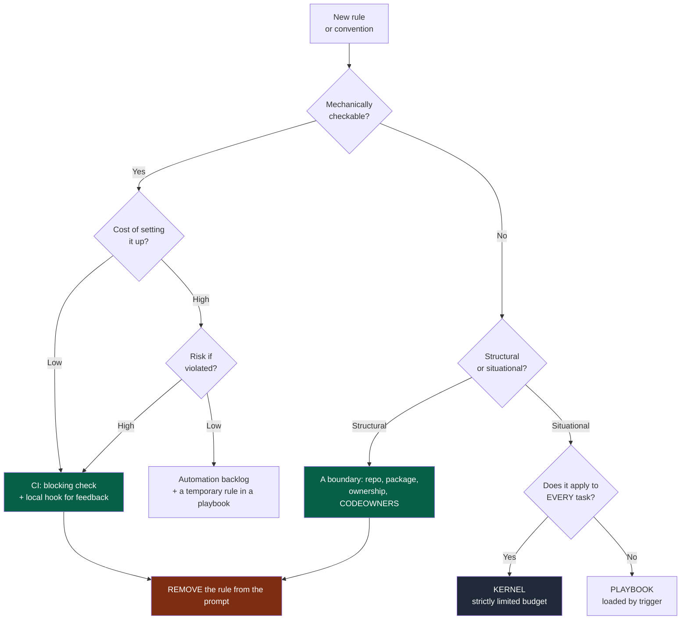
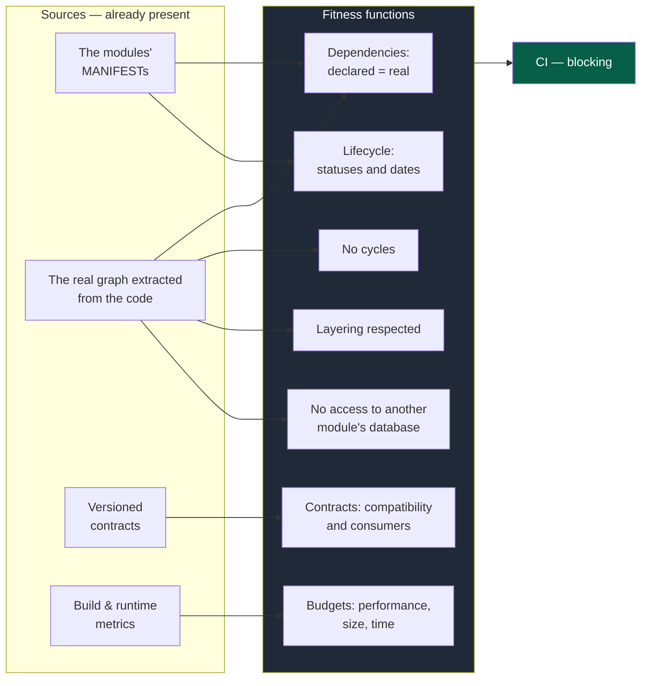
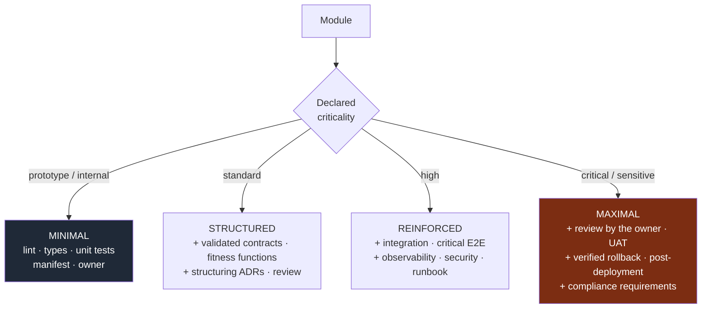
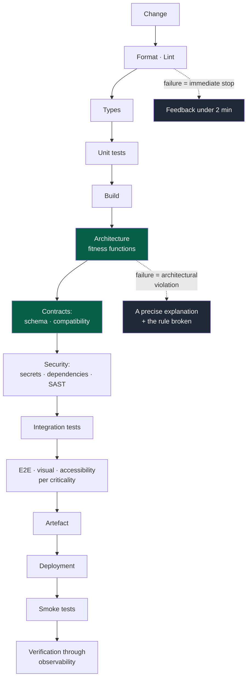

# 07 — Governance

## 1. The principle

> If a rule can be checked automatically, it must **not** depend on the vigilance of the
> AI or of the developer.

This is the move from *governance by inspection* — somebody reviews and spots things — to
*governance by rule*: the system refuses the invalid state.

Corollary: **an important rule checked only by human memory will drift.** Not maybe, not
if the team is careless. It will drift.

---

## 2. Where does this rule live?

This is the central arbitration of the OS and it must be made explicitly, for every new
rule.



**Legend** — green: the deterministic destinations · dark grey: the expensive,
probabilistic one · red: the step everyone forgets.

Node `L` is the most important and the most forgotten: **once automated, the rule leaves
the prompt**. Otherwise the kernel grows indefinitely and ends up costing, on every task,
more context than it protects.

Node `H` also deserves attention: a rule that is not checkable but is structural is often
solved by **structure** rather than by text. "Do not import the other module's code" is a
weak rule; putting the two modules in distinct packages with declared dependencies makes
it unnecessary.

---

## 3. Fitness functions

> An important rule must not stay in the prompt; it must become an automated test that
> fails when the architecture drifts.

This is the mechanism that turns this OS's principles into real constraints.



**Legend** — dark grey: the checks themselves · green: the blocking verdict.

### The basic fitness functions

To put in place from the second module onwards, in order of return:

| # | Function | Detects |
|---|---|---|
| 1 | Declared graph (manifest) = real graph (code) | A hidden dependency, a stray import |
| 2 | No circular dependency | Modules that have become inseparable |
| 3 | No direct access to another module's data | Coupling through the database |
| 4 | Backward compatibility of contracts | An unintentional breakage |
| 5 | Consumers of a deprecated version = 0 before removal | A deliberate breakage, badly sequenced |
| 6 | Consistency of lifecycle statuses | A frozen contract changed, a deprecated module reused |
| 7 | Deprecation dates not passed | Permanent intermediate states |
| 8 | One PR = one module | Boundary erosion |
| 9 | Complete module envelope (manifest, owner, tests) | An orphan module |
| 10 | Performance and size budgets | A silent regression |

The first six are cheap: they are computed from data already present (manifests, imports,
contract schemas). There is **no semantic analysis** — these are comparisons of graphs
and schemas.

Beside them, the engine checks what a shared repository must not carry: a path rooted in one
person's home directory, in any tracked file (H1). It exists on no other machine and
publishes the layout of the one it was written on; an image's or a runner's home, a
placeholder or a variable is the same everywhere.

### Writing a fitness function

A good fitness function is fast (it runs on every pull request), deterministic (no random
false positives), and **explanatory when it fails**. One that says only "architecture
violation" will be worked around; one that says "module A imports `B/internal/x.ts`, but
A's manifest does not declare B; use contract `b-api@v2`" will be respected.

---

## 4. What to automate

In decreasing order of return:

```
Immediately, at almost no cost
  format · lint · type checking · secret detection · commit conventions

From the 2nd module
  unit tests · build · fitness functions 1 to 3 · one PR = one module

From the 1st inter-team contract
  schema validation · contract tests · compatibility · consumers

From going to production
  security analysis · dependencies/CVE · smoke tests · post-deployment verification

When the volume justifies it
  integration tests · targeted E2E · performance budgets · merge queue
```

**The critical checks run in CI.** Local hooks give fast feedback but are **never** the
only barrier: they are bypassable, disableable, and absent on a newcomer's machine.

---

## 5. Quality gates

A quality gate must be: **objective · understandable · reproducible · automated where
possible · useful**.

The last criterion is the most often forgotten, and it is the one that kills buy-in.

| Situation | Response |
|---|---|
| A gate blocks often without ever improving quality | Re-evaluate it or remove it |
| An important rule never respected | Automate it, remove it, or explicitly reconsider |
| A gate systematically bypassed by label | The problem is the gate, not the people |
| A gate so slow that people skip it | Make it fast, or move it later in the pipeline |

> Avoid bureaucratic gates with no value. Every gate has a permanent cost paid by every
> pull request; it must earn its keep.

**Never a silent bypass.** No `skip`, no `--no-verify`, no test disabled "temporarily",
no threshold lowered to make things pass. A necessary bypass goes through a visible label
and leaves a counted trace.

---

## 6. Proportionate governance

The level of requirement depends on the **criticality declared in the manifest**, not on
a uniform rule. Never impose the ceremony of a critical system on a small module; never
treat a critical system like a prototype.



**Legend** — dark grey: the lightest level · red: the heaviest.

Criticality is declared in the manifest, so CI knows which checks to apply to which
module. It is not decided pull request by pull request, which would trigger the
discussion at the worst possible moment.

**It is revisable**, by ADR: a module going to production changes level.

---

## 7. The repository as an organ of governance

The repository is not storage space: it is where rules become non-bypassable. Mechanisms
to use (GitHub wording, transposable elsewhere):

| Mechanism | What it guarantees |
|---|---|
| Pull requests required | No direct change on the protected branch |
| Required checks | A red CI blocks the merge, without exception |
| CODEOWNERS | The right owner is asked automatically |
| Rulesets / branch protection | The rules do not depend on goodwill |
| Issue forms | The DoR is structurally filled in |
| PR template | The DoD is visible at review time |
| Labels | Exceptions are visible and counted |
| Protected environments | Deployment goes through an approval |
| Dependency / security automation | CVEs do not depend on manual watching |
| Merge queue | Avoids merges that break each other |
| A dedicated identity for agents | An agent neither approves nor merges around a human approval |
| Rulesets with an empty bypass list | Nobody, administrators included, merges around a rule |
| Stale approvals dismissed on push | An approval covers the commits its approver read |
| A default code owner | The code owner review covers every path |

> **Critical rules must not be bypassable by an instruction given to the AI.** That is
> the ultimate test of governance: if asking an agent nicely is enough to get around it,
> the rule does not exist.

### Agents and approval

A pull request's author cannot approve it. An agent working with a human's credentials
*is* that human: it can approve a colleague's pull request in their name, then merge. Four
settings close that door, and they only hold together:

1. **The agent has its own identity** — a GitHub App installed on the repository: tokens
   that expire within the hour, never the Administration permission. Its session reaches
   no human credential — no SSH key, token or command-line login of a human — through a
   sandbox, a container or a dedicated system user.
2. **The merge requires a human code owner's approval**, and `CODEOWNERS` starts with a
   default owner: an App can approve, but it is never a code owner.
3. **Nobody is on the rulesets' bypass list**, administrators included.
4. **An approval is dismissed when new commits are pushed**: otherwise a force-push after
   the approval merges content its approver never read.

The human who drove the agent may approve its pull request. A team that wants four eyes
adds "require approval of the most recent reviewable push", or a second reviewer. An
agent's approval does not count toward merging until the test sheets show, module by
module, that an independent verifier finds what a human would (`05-workflow.md` §7).

---

## 8. The CI pipeline

Conceptual order, from the fastest to the most expensive — useful feedback arrives early.



**Legend** — green: the architecture gates · dark grey: what a failure must give back.

**Do not apply every step mechanically to every module.** The level of validation is
proportionate to the risk (§6).

**Feedback time is a quality property.** A thirty-minute CI is a CI people work around,
launch at the end of the day, and whose results they ignore. Feedback time is a tracked
indicator (`10-measurement.md`).

---

## 9. The automation backlog

Every rule that *should* be automated but is not yet is identified debt, not a fact of
life. It sits in a dedicated backlog, with:

- the rule and where it lives temporarily (a playbook, a local AGENTS.md);
- the risk if it is violated;
- the estimated cost of automating it;
- the trigger that will make it a priority.

That backlog is reviewed on the same rhythm as the decision review (`06-decisions.md`
§6). It is the mechanism that stops the kernel growing: every rule added to the prompt
arrives with its planned exit date.
