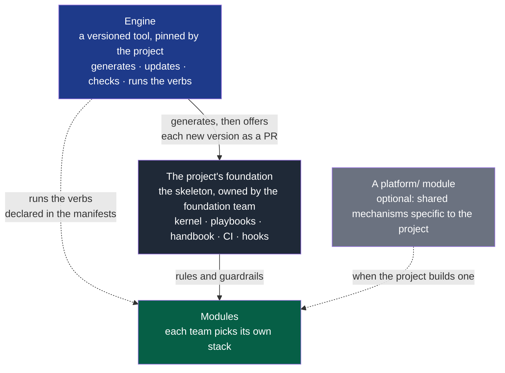
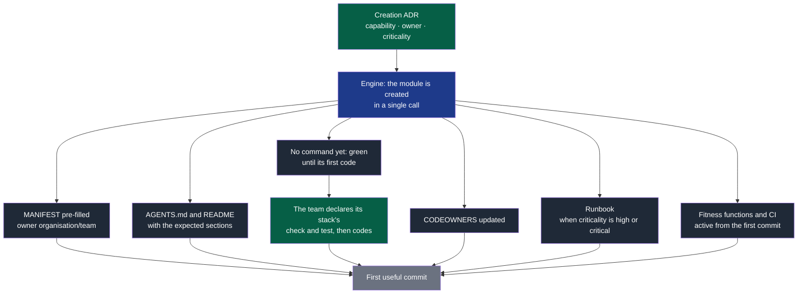

# 09 — Platform

## 1. The platform's role

The platform is what lets several teams work "the same way" **without** sharing their
code or their technical choices.

Its purpose is to **reduce cognitive load**, not to control. Every time a team has to
rebuild a mechanism others have already built — pipeline, templates, checks, bootstrap —
that is a platform failure.

> The platform provides a standardised, automated, safe path.
> It does not provide a prison.

It has two storeys, each with its owner:



**Legend** — blue: the engine, an external tool named in `docs/tooling-profile.md` · dark
grey: the foundation, which the project owns and adapts · light grey: a `platform/`
module, only when the project builds its own shared mechanisms · green: the teams'
modules. Solid line: generation and rules; dotted: execution or use.

The engine is not copied: it is updated by changing version, and the foundation receives
new skeleton versions as a reviewed pull request. A `platform/` module, when it exists, is
a **module** in its own right, with an owner, a manifest, a high criticality and its own
tests. An orphan platform becomes debt nobody dares touch.

---

## 2. The standard verbs

This is the counterpart of the modules' internal heterogeneity. Every module exposes the
same verbs, whatever its technology. They are declared in its manifest, in the `commands`
section, with its own stack's commands.

| Verb | Contract | Must work… |
|---|---|---|
| `bootstrap` | Make the module usable from a fresh clone | Without prior knowledge |
| `check` | All the fast validations: format, lint, types | In under 2 minutes |
| `test` | The module's test suite | With no dependency on another module |
| `run` | Start the module locally | With doubles for the dependencies |
| `e2e` | The module's end-to-end scenarios; evidence written to `.evidence/` | Against the running module, in CI |
| `compat` | Tell whether a change to a contract version is compatible: exit 0 when `$NSTACK_HEAD_PATH` accepts what `$NSTACK_BASE_PATH` did | On the module holding contracts, once one is consumed or stable |
| `contracts` | Validate and generate the contract artefacts | On every contract change |
| `migrate` | Apply the data migrations | When the module owns data |
| `release` | Produce the shippable artefact | Reproducibly |

The engine runs `bootstrap`, `check`, `test`, `run`, `e2e` and `compat`: it reads the command from
the manifest and launches it from the module's folder, locally as in CI. `check` and
`test` are mandatory as soon as the module holds anything beyond its description — its
manifest, `AGENTS.md`, `README.md`, `docs/`; `bootstrap` and `e2e` are optional. A new module
holds only its description: its verbs report that there is nothing to run yet, and
`nstack fitness` asks for `check` and `test` with its first other file. `contracts`,
`migrate` and `release` are reserved names, to declare when a module needs them.

**Why this is the foundation of multi-team work.** A developer or an agent arriving on an
unknown module does not have to discover whether to run `npm`, `make`, `cargo`, `pytest`
or something else. They read the manifest and run `check`. CI does exactly the same,
which guarantees the local and remote checks are identical.

**Isolation rule.** A module's `test` must never require starting another module. If it
does, these are not unit or integration tests but system tests — and that is a signal of
a bad boundary (`02-modules.md` §9).

---

## 3. The skeleton's layout

```
project/
│
├── AGENTS.md                      # the OS kernel
├── README.md
├── CONTRIBUTING.md
├── SECURITY.md
│
├── docs/
│   ├── os/                        # this documentation
│   ├── architecture/              # overview, system diagrams
│   ├── project/                   # the discovery, the charter and the cycles: what the framework cannot know
│   ├── adr/                       # cross-cutting technical decisions
│   ├── pdr/                       # product decisions
│   ├── runbooks/                  # cross-cutting operations
│   └── tooling-profile.md         # mapping capabilities → the tools of the moment
│
├── playbooks/                     # AI instruction modules, loaded on demand
│   ├── discovery.md
│   ├── framing.md
│   ├── security.md
│   ├── tests.md
│   ├── verification.md
│   ├── data-migration.md
│   ├── ux.md
│   └── operations.md
│
├── contracts/                     # ← a module in its own right, dedicated owner
│   ├── MANIFEST.yaml
│   ├── <contract>/
│   │   ├── v1/
│   │   └── v2/
│   └── tests/
│
├── modules/                       # empty at creation
│   ├── <module-a>/
│   │   ├── MANIFEST.yaml
│   │   ├── AGENTS.md
│   │   ├── README.md
│   │   ├── docs/adr/
│   │   ├── src/
│   │   └── tests/
│   └── <module-b>/
│       └── …
│
└── .github/
    ├── ISSUE_TEMPLATE/
    ├── workflows/
    ├── CODEOWNERS
    └── pull_request_template.md
```

> `modules/` can become `services/`, `apps/` or `packages/` depending on the nature of
> the project. What matters is that each unit carries its manifest and its complete
> envelope, not the name of the parent folder. A `platform/` module and a
> `docs/governance/` folder (automation backlog, reviews) are added when the project
> needs them; the skeleton does not create them.

---

## 4. Creating a new module

This is the most revealing test of a platform's maturity: **how long between the decision
and the first useful commit?**



**Legend** — green: the team's decision or work · blue: the engine · dark grey: what is
generated · light grey: the result.

The critical point is `C6`: **the guardrails are active from the first commit**. A module
created without fitness functions will accumulate violations discovered too late, and
eventually tolerated because fixing them has become too expensive. `C3` is its corollary:
a module is green while it holds nothing to check, and fails in CI from its first file of
code whose commands are not declared — never green while checking nothing.

---

## 5. Onboarding

The goal is measurable: **a newcomer — human or agent — must be able to contribute
usefully without a spoken conversation.**

The expected path:

```
0. read the charter and the current cycle → who it is for, what is being delivered now
1. read the module's MANIFEST      → what it is for, who owns it, what it consumes
2. read the local AGENTS.md        → specific conventions and traps
3. run bootstrap then check        → a working environment, validations green
4. read the contracts consumed     → what it can rely on
5. read the module's ADRs          → why it is the way it is
6. pick up a Ready issue           → scope and criteria already explicit
```

If one of these steps requires asking somebody, that is a defect of the system, not of
the newcomer. Time to first contribution is a tracked indicator (`10-measurement.md`).

The repository must be able to answer, on its own: who owns what · how to contribute ·
how to test · how to ship · which rules apply · which validations are mandatory.

---

## 6. AI tooling

> Tools are **adapters**, never architectural foundations.

The OS prescribes no tool, for a simple reason: the ecosystem changes faster than the
principles do. A skeleton that imposes "use this plugin and that extension" will be wrong
in twelve months, while its principles will still hold.

Nor does the OS embed an AI: it is the team's agent that reads the kernel and the
playbooks, runs the verbs and proposes changes, which CI accepts or refuses exactly as it
would from any other contributor.

The OS therefore declares **capabilities**, and a *tooling profile*
(`docs/tooling-profile.md`) maps them onto the tools of the moment. Changing tool then
happens without touching the OS.

| Capability | What it is for |
|---|---|
| Searching and navigating the repository | A local inventory without loading everything |
| Reliable documentary research | Verify rather than assume (`04-ai-context.md` §6) |
| Access to official sources | Versions, APIs, real constraints |
| Running commands and tests | Making the oracle actually executable |
| Git, issue and pull request interaction | Traceability and small batches |
| Agent identity | Changes arrive under the agent's own name, behind a human approval |
| UI inspection and screenshots | UX validation beyond "it compiles" |
| Driving a browser or an emulator | Explored scenarios of a test sheet, with their evidence |
| Security analysis | Integrated automated checks |
| Architecture analysis | Support for the fitness functions |
| Specialised agents | Independent review, isolated investigation |

**Criteria for choosing a tool**: the project, security, confidentiality, reliability,
cost, maturity, integration, and above all **the ability to be automated**. A tool useful
only interactively can never become a guarantee.

> Never add a tool because it is popular. The Prior Art Gate applies to tools too
> (`06-decisions.md`).

---

## 7. The skeleton as a miniature internal platform

A new project starts with the conventions, the checks, the templates and the workflows
**already in place**. That is what makes the OS real rather than theoretical: without a
skeleton, every project reimplements the same mechanisms, with variations that eventually
prevent any sharing.

What the skeleton and its engine provide from day one:

- the kernel and the playbooks;
- execution of the standard verbs declared in the manifests;
- the ADR, PDR, issue and pull request templates;
- the basic fitness functions (1 to 3 of `07-governance.md` §3);
- CI with the checks of the `standard` level;
- CODEOWNERS, and the checklist of forge settings, which the engine verifies read-only;
- module creation;
- new skeleton versions, offered as a reviewed pull request and merged with the project's
  adaptations.

What it does **not** provide: a stack, an internal architecture, a list of tools, an AI.
Those choices belong to the project and go through an explicit decision.
