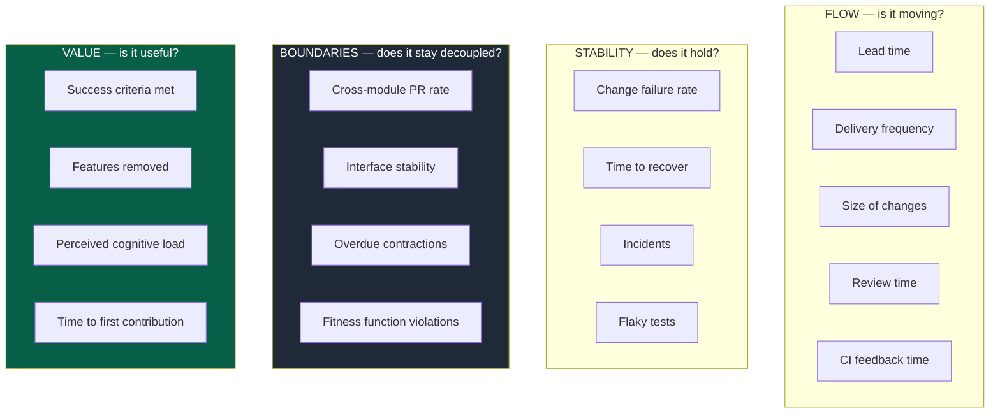
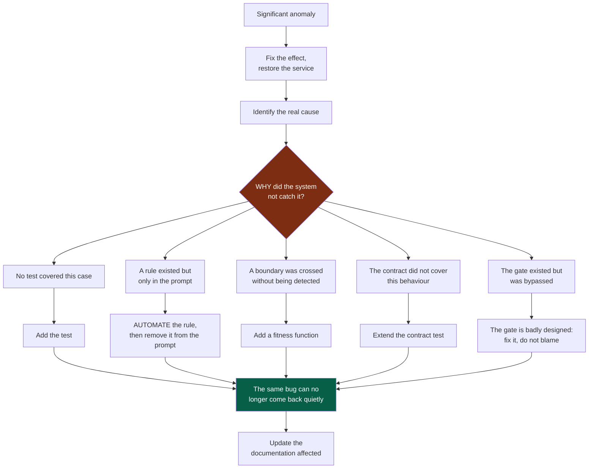

# 10 — Measurement and improvement

## 1. What metrics are for

> Metrics exist to improve the system, not to produce artificial targets.

Any metric turned into an individual target stops measuring what it used to measure. The
indicators in this document are read at **system** level: they answer "where does it
grind?", never "who is performing?".

**Never optimise the amount of code produced.** It is the one metric agents inflate
effortlessly, and it is inversely correlated with what we are after.

---

## 2. The four families



**Legend** — dark grey and green: the two families specific to this OS, and the most
informative here. The first two are the classic ones.

---

## 3. The indicators that really matter

### Cross-module PR rate

**The best indicator of boundary quality.** It is collected for free, since a
cross-module pull request requires an explicit label (`02-modules.md` §7).

| Trend | Reading |
|---|---|
| Low and stable | The boundaries hold |
| Rising | A boundary is decaying — look at which pair of modules keeps coming back |
| Concentrated on two modules | Those two should probably be merged, or split differently |

### Over-budget PR rate

Measures the real pressure of generation on verification capacity (`05-workflow.md` §4).
A rise means you are producing faster than you verify, and that review quality is
degrading quietly — well before incidents go up.

### Out-of-cycle PR rate

The share of delivery pull requests carrying the `out-of-cycle` label. Low: the cycles
bound the work. Rising: either incidents are rising, or the framing no longer matches what
the team really does — re-frame.

### Cycles ended by their circuit breaker

How many cycles ended at their end date rather than with every deliverable accepted. An
occasional one is healthy: the appetite held. Every one: the appetites or the deliverables
are wrong — frame smaller.

### Findings beyond the verifier

On every pull request carrying a test sheet, what the approver found that the verifier had
missed. It is the measurement that may one day let a verifier agent's approval count,
module by module (`07-governance.md` §7).

### Overdue contractions

The number of deprecated contract versions whose removal date has passed
(`03-contracts.md` §4). It is the direct measure of **permanent intermediate states**. It
should never grow durably.

### CI feedback time

A slow CI is not merely unpleasant: it is **worked around**. Past a certain threshold,
developers stop running the checks locally, push to see, and ignore the results. Feedback
speed is a quality property, not a comfort.

### Success criteria met

The proportion of decisions whose dated criterion was actually checked at the deadline
(`06-decisions.md` §5). If that proportion is low or unknown, the decision documentation
is decorative.

### Features removed

A project that never removes anything accumulates. It is not an indicator to maximise,
but one that **must not stay at zero** indefinitely.

---

## 4. The post-incident feedback loop



**Legend** — red: the only question that matters · green: the outcome that makes the
post-mortem worth holding.

> **Do not simply fix a bug: improve the system that let the bug through.**

Question `D` is the only one that really counts. A post-mortem that stops at the
technical cause produces a fix; one that answers "why did the system not see it?"
produces a guardrail.

> The goal: **turn past mistakes into future guardrails.**

Note how case `E5` is handled: when a gate has been bypassed, the reflex of blaming the
individual is a dead end. A gate that is systematically bypassed is a badly designed gate
— too slow, too noisy, or with no perceived value (`07-governance.md` §5).

---

## 5. The rituals

Three meetings are enough. All of them produce a decision, never a mere observation.

| Ritual | Frequency | Content | Output |
|---|---|---|---|
| **Boundary review** | Monthly | Cross-module PRs, fitness function violations, overdue contractions | *Architecture* issues, or nothing |
| **Decision review** | Quarterly | ADRs/PDRs whose criterion has come due | Confirmed · superseded · feature removed |
| **Automation backlog review** | Quarterly | Rules still living in the prompt | Automate · remove · renew with a deadline |

The last two can be held together: they address the same subject from two sides — what
should have left the prompt, and what should have left the product.

---

## 6. Improving the OS itself

The OS is subject to its own rules. In particular:

**The kernel has a budget.** 250 lines. Adding a rule means removing another or
automating it. Without that constraint the kernel grows at every incident and turns back
into the 6 000-word document it replaces.

**Every rule in the prompt is a candidate for automation.** Its presence in the kernel or
in a playbook is a transient state, documented in the automation backlog with a planned
deadline.

**A structuring change to the OS goes through an ADR.** Adding a document format, a
playbook, a law to the kernel, or changing the review budget are structuring decisions.

**The signals that should trigger a revision of the OS:**

| Signal | What it indicates |
|---|---|
| A kernel rule is never followed | It is badly worded, or in the wrong place |
| A playbook is never triggered | The trigger is badly defined, or the playbook is useless |
| An exception has become the norm | The rule does not match the reality of the project |
| Agents keep reporting the same blocker | The system has a structural defect, not the agents |
| The kernel goes over its budget | An automation has been postponed for too long |

---

## 7. The ultimate criterion

> A new developer, a new team or a new agent must be able to understand quickly **what
> they need to know, what they may change, what they must not change, and how to verify
> their work is correct.**

If that is not possible, the problem is architectural, documentary or organisational —
**not only a code problem**.

```
Build fast.
Build small.
Build with boundaries.
Reuse what exists.
Document the decisions.
Automate the rules.
Verify systematically.
Evolve the architecture continuously.
```
