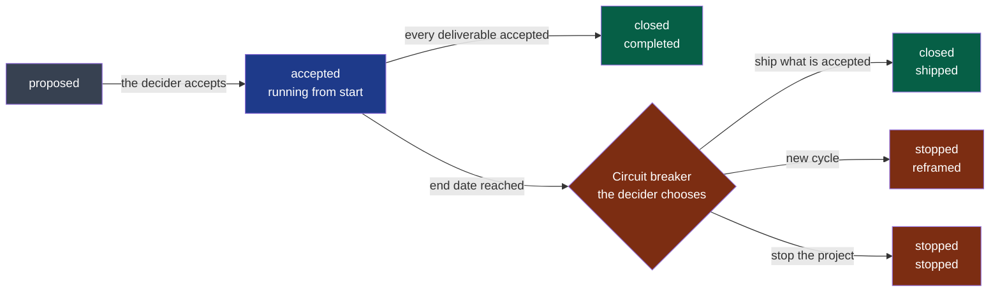

# Project

What the framework cannot know about this project: who it is for, when it is finished,
and what is being delivered now. Every agent session reads the charter and the current
cycle before working (`AGENTS.md` §4).

| File | Holds | Written by | Accepted by |
|---|---|---|---|
| `discovery.md` | An idea tested: evidence, value hypothesis, challenge, decision | The framer, then the challenger (`playbooks/discovery.md`) | The decider |
| `charter.md` | Users, problem, constraints, risks, success criteria, out of scope | The framer (`playbooks/framing.md`) | The decider |
| `cycles/NN-<slug>.md` | One goal, a finite list of deliverables, an appetite, an end date, the closure | The framer | The decider |
| `_CHARTER_TEMPLATE.md`, `cycles/_TEMPLATE.md` | The templates | — | — |

**Legend** — grey: a proposal · blue: the cycle in progress · green: an accepted end ·
red: the circuit breaker and what it can lead to.

## What CI checks

| Check | When | Rules |
|---|---|---|
| The plan, a fitness function | Every push | Formats; one accepted cycle at a time, under an accepted charter; `end` = `start` + the appetite; acceptance criteria once a deliverable is ready; closures recorded; a discovery decided with its decider and date, a charter only after a go |
| The pull request check | Every pull request changing a module beyond its description — manifest, `AGENTS.md`, `README.md`, `docs/`; not a framework update | An accepted cycle; not past its end date; a ready or in-progress deliverable named — or the `out-of-cycle` label with its justification |

The charter changes only through a PDR (`docs/os/06-decisions.md` §4). A cycle is never
extended: past its end date, delivery work stops until the decider records a decision.
