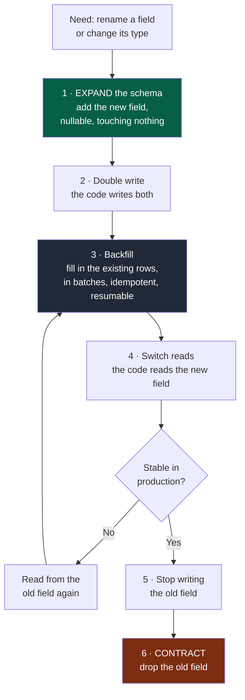

# Playbook — Data and migrations

> **Trigger.** Load this playbook when the task touches: a data schema, a migration, the
> deletion or transformation of existing data, data ownership.

---

## Absolute rules

| # | Rule |
|---|---|
| D1 | **A migration is a production change**, not a code change. It falls under high-risk actions (kernel §5). |
| D2 | **Each module owns its data.** No direct access to another module's database — you go through its contract. |
| D3 | **Never rename or delete in place.** You add, you let both coexist, you migrate, you remove. |
| D4 | **Every migration has a rollback plan**, or a written justification for not having one. |
| D5 | **Never run a destructive migration without explicit confirmation.** |

---

## 1. Expand / Contract applied to the schema

The same logic as contracts (`docs/os/03-contracts.md`), for the same reason: the old and
the new code coexist during the deployment.



**Legend** — green: the additive step, always safe · dark grey: the operational step ·
red: the irreversible step, the one that gets forgotten.

Each step is **a pull request deployable on its own**. At no point is the system in a
state where a rollback would break the data.

Step 6 is the most forgotten. As with contracts: it carries a date, and a check fails
once that date has passed.

---

## 2. Before any migration

| Question | If the answer is missing |
|---|---|
| How many rows are affected? | Measure before writing the migration |
| Does it lock a table? For how long? | Test on a representative volume |
| Does the old code still work afterwards? | It must, during the deployment |
| Does the new code work beforehand? | Same, the other way round |
| What happens to non-conforming data? | Count it, decide explicitly |
| How do you roll back? | Write the plan, or justify its absence |
| How will you know it went well? | Define the verification before starting |

---

## 3. Backfill

A backfill over a large volume is an operational procedure, not a script.

- **In batches**, with a pause between batches — never process everything at once.
- **Idempotent**: re-runnable with no side effect.
- **Resumable**: remembers its progress, survives an interruption.
- **Observable**: progress, errors, estimated duration.
- **Interruptible**: it must be possible to stop it without corrupting the state.
- **Measured beforehand**: row count, estimated duration, impact on load.

---

## 4. Deleting data

This is irreversible. Mandatory procedure:

```
1. count exactly what will be deleted
2. check the selection criterion against a sample
3. back up or archive what is being deleted
4. run in dry-run mode first
5. ask for explicit confirmation, with the exact count
6. delete in batches, with a stopping point
7. verify afterwards
```

A deletion triggered by a retention rule is a product decision: it belongs to a PDR, not
to a technical task.

---

## 5. Data ownership

Implicit data sharing is the hardest form of coupling to undo, because it is invisible
in the code.

| Situation | Handling |
|---|---|
| A module reads another's table | A violation — detected by a fitness function |
| Database shared between two modules | ADR required, with explicit ownership per table |
| Data duplicated across modules | Acceptable when a source of truth is designated and the synchronisation is contractual |
| A join across domains is needed | A signal of a bad boundary — do not work around it with direct access |

---

## 6. Closing checklist

- [ ] Migration tested on a representative volume
- [ ] Old and new code both work during the transition
- [ ] Backfill in batches, idempotent, resumable
- [ ] Rollback plan written, or its absence justified
- [ ] Post-migration verification defined **before** the run
- [ ] Contraction step planned, with a date and an owner
- [ ] Destructive action explicitly confirmed, with the exact count
- [ ] Whatever could not be verified appears under `NOT VERIFIED` in the summary
