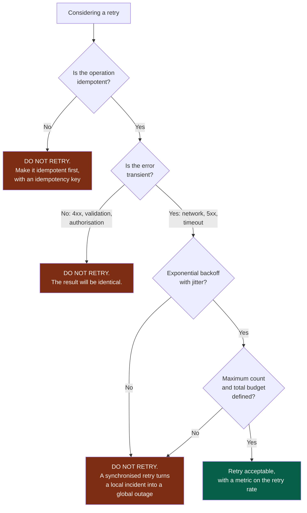
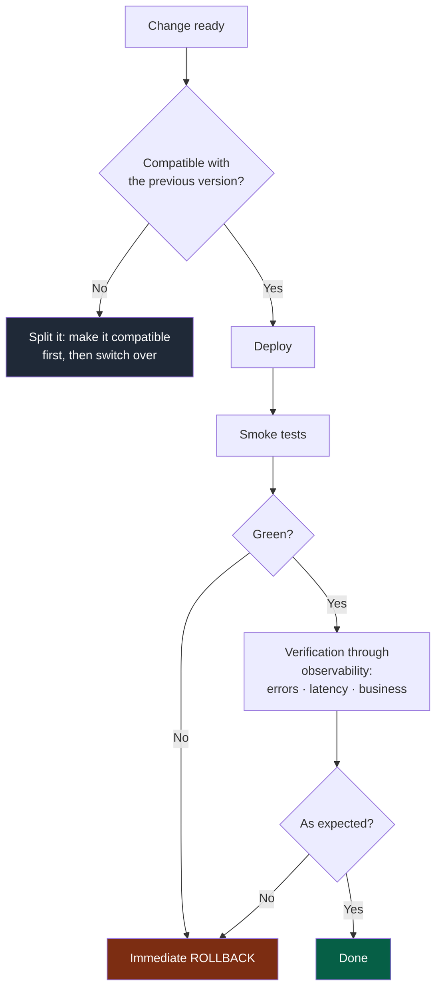

# Playbook — Operations and reliability

> **Trigger.** Load this playbook when the task touches: logs, metrics, alerts, retries,
> timeouts, rollback, health checks, deployment, or any call to an external dependency.

---

## Absolute rules

| # | Rule |
|---|---|
| E1 | **Never an automatic retry without analysing the side effects.** |
| E2 | **Every external call has an explicit timeout.** A call without one is an outage waiting to happen. |
| E3 | **No secret and no personal data in the logs.** |
| E4 | **An error quietly swallowed is a future incident.** |
| E5 | **A module in production with no way of knowing it is unwell is not ready.** |

---

## 1. Retries — the classic trap

**Legend** — red: do not retry, and why · green: the only branch where a retry is safe.

Three side effects to check every time:

- **Duplication** — a retry on a non-idempotent operation applies the effect twice.
- **Amplification** — N clients retrying at the same time multiply the load on a service
  already in trouble.
- **Masking** — a retry that succeeds hides a real degradation. The retry rate is
  therefore a metric, not an implementation detail.

---

## 2. Timeouts

| Rule | Why |
|---|---|
| Every external call has an explicit timeout | A call without one blocks a thread indefinitely |
| The timeout is shorter upstream than downstream | Otherwise the caller gives up before the callee, and the work is lost |
| A total budget exists for the request | Prevents cascading timeouts from accumulating |
| The timeout is a configured value, not a buried constant | It will need adjusting in production |

---

## 3. Logs

| Do | Avoid |
|---|---|
| Structured, machine-readable | Concatenated strings nothing can parse |
| A correlation identifier propagated | Logs impossible to tie together |
| Useful context: what, where, which identifier | "Error" with no context |
| Consistent levels, actually respected | Everything at `info`, or everything at `error` |
| Masking sensitive data **at the source** | Masking at display time |

A log that does not let you reconstruct what happened has only occupied disk space.
Control question: *at 3 a.m., does this log let me understand without reading the code?*

---

## 4. Metrics and alerts

| Type | Example |
|---|---|
| Traffic | Requests, messages processed |
| Errors | Error rate, by type |
| Latency | The distribution, not only the mean |
| Saturation | Queue, connections, memory |
| Business | What the module is supposed to produce |

**The mean hides everything.** A healthy average latency can conceal 5 % of users waiting
ten seconds. Always look at the distribution.

### Alerts

| Rule | Reason |
|---|---|
| Alert on a **user-visible symptom**, not on a technical cause | Causes change, the symptom stays relevant |
| Every alert is **actionable** | An alert with nothing to do will be ignored |
| Every alert points to a **runbook** | Otherwise the knowledge sits in one person's head |
| An alert that fires with no action taken is **removed or fixed** | Noise destroys the value of every alert |

---

## 5. Health checks

| Type | Answers | Trap |
|---|---|---|
| *Liveness* | Should the process be restarted? | Must **not** depend on external dependencies — otherwise an external outage causes a restart loop |
| *Readiness* | Can it take traffic? | Must check the critical dependencies |
| *Startup* | Has it finished starting? | Avoids restarts during a slow initialisation |

---

## 6. Deployment and rollback

**Legend** — red: roll back · green: done · dark grey: split the change instead.

- **Rollback is tested**, not assumed. A rollback never executed probably does not work.
- **A deployment is not finished at deploy time**: it is finished when observability
  confirms the expected behaviour.
- **Backward compatibility is mandatory**: during the deployment two versions coexist. An
  incompatible change is split up (`docs/os/03-contracts.md`).

---

## 7. Controlled degradation

Decide **in advance** what happens when a dependency is unavailable:

| Strategy | When |
|---|---|
| Fail cleanly | The feature makes no sense without the dependency |
| Serve a default value | An approximation beats nothing |
| Serve from a cache, even a stale one | Freshness matters less than availability |
| Disable the feature, keep the rest | The dependency is secondary |
| Queue for deferred processing | The operation can be asynchronous |

The choice is explicit and tested. Without a prior decision, the default behaviour is
always the worst one: an opaque error at the worst possible moment.

---

## 8. Closing checklist

- [ ] Explicit timeouts on every external call
- [ ] Retries justified, idempotent, with backoff and a ceiling — or absent
- [ ] Logs structured, correlated, free of secrets and personal data
- [ ] Errors never swallowed quietly
- [ ] Metrics and alerts actionable, pointing at a runbook
- [ ] Health checks correct (liveness with no external dependencies)
- [ ] Backward compatibility verified
- [ ] Rollback documented and tested
- [ ] Behaviour on unavailability decided explicitly
- [ ] Whatever could not be verified appears under `NOT VERIFIED` in the summary
