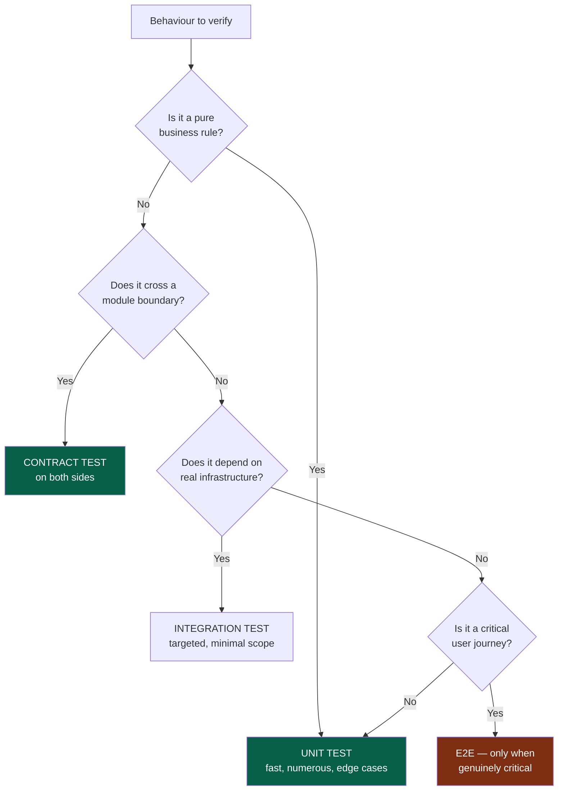
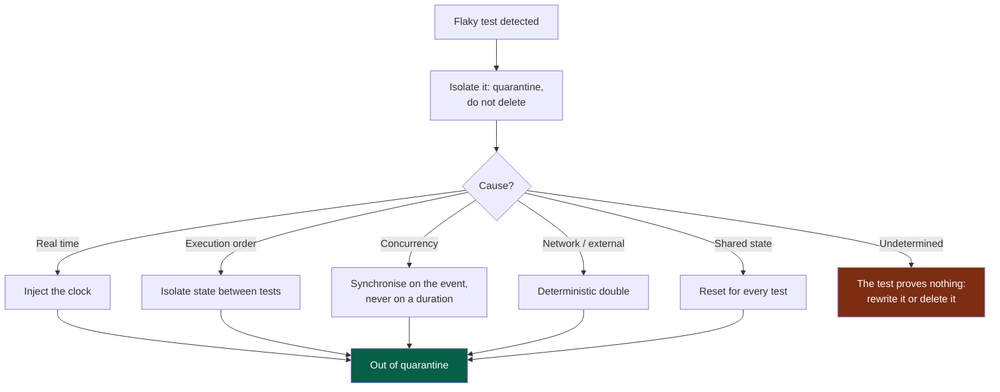

# Playbook — Tests

> **Trigger.** Load this playbook when the test strategy is not obvious: an untested
> area, a flaky test, a behaviour that is hard to isolate, doubt about the right test
> level.
>
> For an ordinary task the kernel rule is enough: **write the oracle, watch it fail,
> implement**.

---

## 1. Choosing the test level



**Legend** — green: the levels to prefer · red: the level to use sparingly.

Preference rule: **the lowest level that actually verifies the behaviour**. An E2E test
that could have been a unit test costs a hundred times more, breaks ten times more
often, and diagnoses ten times worse.

A scenario replayable end to end belongs in the module's `e2e` command, and its evidence in
`.evidence/`: CI keeps it for the test sheet (`docs/os/05-workflow.md` §7).

---

## 2. The oracle

| Requirement | Why |
|---|---|
| Written **before** the implementation | Otherwise it is written to pass, not to verify |
| Watched **failing** first | A test never seen red may test nothing |
| Fails for the **right reason** | A compilation failure is not a test failure |
| Named after the **behaviour**, not the function | `refuses_an_order_without_stock`, not `test_create_order_2` |

### When the oracle is impossible

| Cause | Response |
|---|---|
| Subjective criterion | Restate it as an observable behaviour |
| Exploratory task | Requalify it as a *spike*: the deliverable is knowledge |
| Untestable area | Make it testable first, as a separate task |
| Vague need | Back to framing — it was not *Ready* |

In every case: **do not generate while waiting.**

---

## 3. What to test first

```
1. business rules           2. critical journeys       3. permissions
4. contracts                5. errors                  6. edge cases
7. regressions that happened   8. high user impact
```

**Every regression fixed gets a test** that failed before the fix. That is the only
guarantee it will not come back quietly.

**Do not aim at a coverage percentage.** Coverage tells you what is not tested; it never
tells you that what is tested is tested well.

---

## 4. Edge cases to consider every time

```
empty · null · absent · zero · negative · very large · very long
special characters · unicode · leading and trailing whitespace
duplicate · concurrency · repeated call (idempotence)
dependency unavailable · timeout · partial response
authorisation refused · not authenticated · session expired
time zone · daylight saving · deadline date
```

---

## 5. Flaky tests

A flaky test is an **engineering problem**, never a fact of life. Its real cost: it
teaches the team to ignore a CI failure. A single tolerated flaky test degrades the
value of the whole suite.



**Legend** — green: back to a trustworthy suite · red: the test is not worth keeping.

**Never "re-run until it passes".** A disabled test carries an issue and a date to pick
it back up; without that, it never comes back.

Fixed waits (`sleep`) are the most widespread cause of flakiness: wait for an
**observable state**, never for a duration.

---

## 6. Doubles

| Double | Do not double |
|---|---|
| External services, network, clock, randomness | The business logic of the module under test |
| Slow or expensive dependencies | What the test is meant to verify |
| Other modules — through their **contract** | The database, in an integration test |

> **Never double another module's behaviour by guessing.** You double its contract, and
> the contract test guarantees the contract matches reality. An invented double goes
> green while production breaks.

---

## 7. Warning signals

| Signal | Reading |
|---|---|
| A test breaks at every refactor with no behaviour change | It tests the implementation, not the behaviour |
| You have to start another module to test | Bad boundary (`docs/os/02-modules.md` §9) |
| The test is longer than the code it tests | The code is probably too coupled |
| Nobody understands what this test tests | Delete it or rewrite it; it protects nothing |
| The suite takes more than 10 minutes | It will be bypassed — making it fast is a priority task |
