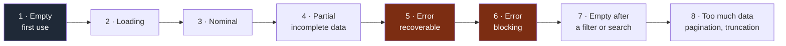

# Playbook — UX/UI

> **Trigger.** Load this playbook as soon as the task touches a surface visible to the
> user.

---

## Entry rule: convention wins

This is the ground where the Prior Art Gate (`docs/os/06-decisions.md`) pays off most.

> For an interface pattern, the value of the convention comes **precisely from the fact
> that the user already knows it**. An unrequested interface innovation is a learning
> cost imposed on every user for the satisfaction of a single designer.

Before designing a component or a journey:

1. does the project's design system already cover it? → use it, done.
2. otherwise, what is the established convention for this problem? → adopt it.
3. departing from it requires a named, observable user value.

**Never create a component that already exists in the design system.** It is the most
common form of wheel reinvention, and the most expensive to undo.

---

## The eight states of an interface

A feature is not finished if one of these states has not been handled. It is the number
one cause of the gap between "it works on my machine" and "it is usable".

**Legend** — dark grey: the state every user sees first · red: the error states.

States 1, 7 and 8 are the most systematically forgotten. Yet state 1 is the one **every**
user sees first.

---

## Error messages

| Do | Avoid |
|---|---|
| Say what happened, in the user's language | Showing a technical code alone |
| Say **what to do next** | "An error has occurred" |
| Preserve what the user had typed | Clearing the form |
| Distinguish an input error from a system failure | Treating both the same way |
| Stay discreet about the technical detail | Exposing a trace or an exploitable detail |

An error message with no possible action is a dead end: the user can only start again
identically.

---

## Accessibility

Not negotiable as soon as there is an interface. Minimum checks:

| Point | Test |
|---|---|
| Full keyboard navigation | Go through the whole feature without a mouse |
| Focus visible at all times | Tab from end to end |
| Sufficient contrast | Automated check |
| Images and icons that carry meaning | Text alternative |
| Forms | Associated labels, errors tied to the field |
| Information never carried by colour alone | Visual check |
| Consistent heading structure | Document inspection |
| Large enough touch targets | Test on a real mobile device |
| Dynamic region | Change announced to screen readers |

Whatever can be automated is automated in CI. **The rest is tested with the keyboard**,
in a few minutes — the best effort-to-detection ratio in the field.

---

## Perceived performance

What matters is the **felt** time, not the measured time.

| Situation | Handling |
|---|---|
| Action expected to be instant | Immediate visual feedback, before the server even answers |
| Short wait | A discreet indicator, no full blocking |
| Long wait | Real progress, and a cancellable action where possible |
| Content arriving in pieces | Reserve the space to avoid layout shifts |
| Optimistic action | Plan the rollback explicitly in case of failure |

---

## Responsive and mobile

The development machine is not representative.

- Check at a narrow width, not only in a resized browser.
- Test touch interactions: no hover as the only trigger.
- Check the behaviour with the virtual keyboard open.
- Check over a slow connection.

---

## Closing checklist

- [ ] The 8 states handled, or explicitly out of scope
- [ ] Convention or design system respected; every deviation justified
- [ ] Error messages actionable
- [ ] Full keyboard navigation, focus visible
- [ ] Contrasts checked
- [ ] Tested at a real mobile width
- [ ] Visual feedback on every action
- [ ] No component reinvented
- [ ] The test sheet covers the 8 states, or states which are out of scope (`verification.md`)
- [ ] Whatever could not be verified appears under `NOT VERIFIED` in the summary
